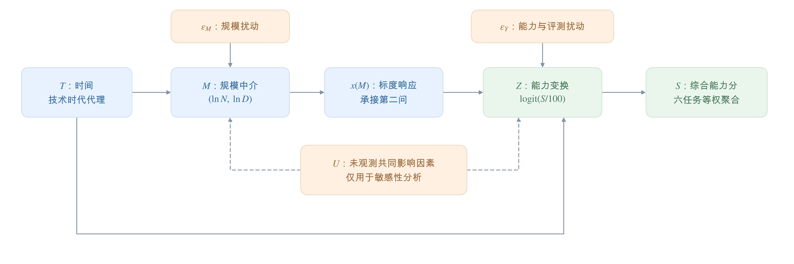
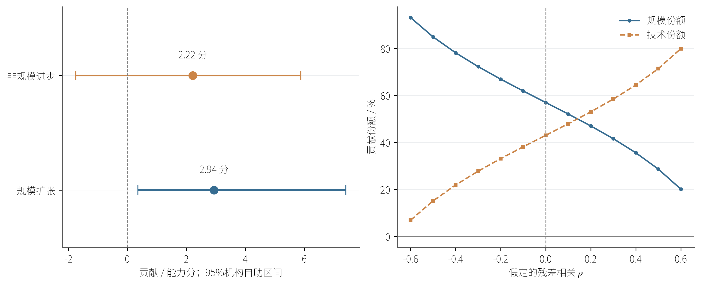

## 8  技术演进的历史归因与条件前沿预测

本问依次回答历史增长来源、损失换算依据和未来能力前沿。问题二提供规模收益形状，问题三给出最优资源配置，附件C估计能力响应；历史归因与未来预测分别建模、验证。

## 8.1  研究对象与能力指标

历史归因使用参数量、训练Token数和发布日期齐全的35个基础模型，覆盖10家机构；2449条经筛选、去重的榜单记录只承担分类型趋势对照。这里“开源”的操作口径为附件声明权重开放且许可证明确允许至少研究使用。主样本排除已标注底模的衍生模型及明显的混合专家模型，不填补缺失训练量，以减少后训练数据与预训练数据混用。

综合能力S由IFEval、BBH、MATH Lvl 5、GPQA、MuSR、MMLU-PRO六项归一化得分等权计算，单位为分：

公式 8-1

$$
S_i=\frac{1}{6}\sum_{k=1}^{6}s_{ik},\qquad 0\leq S_i\leq100.
$$

令Z=logit(S/100)，即把0—100分转换到实数尺度；计算时将S/100截断至[0.001,0.999]，逆变换为S=100/(1+e⁻ᶻ)。N、D分别表示以十亿计的参数量和训练Token数。历史时间T为发布日期距2023年1月1日的年数，每年按365.25天计算；榜单提交日期仅用于独立的趋势对照。数据匹配、任务重建与其他时间原点见附录四。

## 8.2  历史能力增长的两路径模型

## 8.2.1  从规模扩张到能力响应

结构中介模型＝把时间对能力的变化拆成经规模传递和直接进入能力响应的两条路径。如图8-1，时间推动参数量与训练量变化，再通过标度响应影响能力；控制规模后剩余的时间项，在无未处理的时间—规模—能力混杂、样本选择未扭曲比较、评测口径可比且规模范围充分重叠的主假设下，解释为非规模进步。架构、优化和数据工程等因素在此合并体现，现有样本无法再单独识别历史质量与配比贡献。

图8-1  历史能力变化的规模路径与非规模路径

首先建立规模中介方程，保留同一模型参数投入与数据投入的相关性：

公式 8-2

$$
M_i=\begin{pmatrix}\ln N_{B,i}\\\ln D_{B,i}\end{pmatrix}=a_0+a_TT_i+\varepsilon_{M,i}.
$$

其中M为两维对数规模向量，a₀、a_T为待估系数，ε_M为规模扰动。由问题二固定的A、B、α、ν构造可约损失r及规模指数x：

公式 8-3

$$
r(N_B,D_B)=AN_B^{-\alpha}+BD_B^{-\nu},\qquad x(N_B,D_B)=-\ln r(N_B,D_B).
$$

x越大，表示该规模对应的可约损失越低。将其接入能力响应：

公式 8-4

$$
Z_i=\beta_0+\kappa x(N_{B,i},D_{B,i})+\gamma_TT_i+\varepsilon_{Y,i}.
$$

β₀、κ、γ_T由35个模型重新估计，主模型不限制κ与γ_T的符号。固定标度形状可减少小样本中待估参数，但引入跨模型族迁移假设；其合理性由自由对数规模模型、仅规模模型和仅时间模型进行同划分对照。主假设允许两维规模扰动相关，同时要求规模扰动与能力扰动ε_Y独立、扰动分布跨期稳定。

## 8.2.2  参数估计与贡献分解

两组方程均以无权最小二乘估计。由于规模响应和分数逆变换均为非线性，贡献不能由回归系数直接相除得到。定义G(t,t′)为“非规模条件取t、规模条件取t′”时的反事实平均能力：先在t′下生成规模，再在t下计算能力，并对经验扰动平均。规模残差成对保留，两类方程残差交叉平均，具体计算见附录四。

比较初期t₀与后期t₁，对两条路径的两种切换顺序取平均，得到规模贡献Δ_S和非规模贡献Δ_T：

公式 8-5,8-6

$$
\begin{aligned}\Delta_S&=\tfrac12[G(t_0,t_1)-G(t_0,t_0)+G(t_1,t_1)-G(t_1,t_0)],\\\Delta_T&=\tfrac12[G(t_1,t_0)-G(t_0,t_0)+G(t_1,t_1)-G(t_0,t_1)].\end{aligned}
$$

两项之和恰等于G(t₁,t₁)−G(t₀,t₀)，因此能力增量完整分配而不重复计算。比较日期固定为主样本发布日期的上下四分位，即2023年4月3日与2024年6月7日；按机构整组重抽样400次，每次重估模型，以2.5%和97.5%分位构造95%区间。

## 8.2.3  历史贡献及其可解释范围

主模型的反事实平均能力由9.115分升至14.273分，增量为5.159分。规模贡献为2.939分，占56.98%；非规模贡献为2.219分，占43.02%。图8-2将贡献区间与混杂敏感性放在一起，区分点估计与结论的稳定程度。

图8-2  历史贡献的95%重抽样区间与混杂敏感性

规模贡献的95%区间为[0.359,7.412]分，非规模贡献为[−1.754,5.887]分。因此，两条路径的点估计均为正，但现有样本尚不能精确确定非规模贡献的符号及比例。自由规模响应下的规模份额降为44.44%；当假设混杂相关系数ρ在[−0.6,0.6]内变化时，规模份额为20.12%—93.09%。规模是否占多数取决于响应结构与混杂假设，56.98%应作为主模型条件下的估计报告。

表8-1  历史能力模型的样本外误差

表8-1  历史能力模型的样本外误差

| 模型 | 机构留出 MAE / RMSE | 日期留出 MAE / RMSE |
| --- | --- | --- |
| 标度响应＋时间 | 3.205 / 4.646 | 6.426 / 8.810 |
| 自由lnN、lnD＋时间 | 3.776 / 5.139 | 6.657 / 9.136 |
| 仅规模 | 3.375 / 4.817 | 7.114 / 9.845 |
| 仅时间 | 5.506 / 7.158 | 9.088 / 12.075 |

MAE＝平均绝对误差，RMSE＝均方根误差，均以能力分计。表8-1中主模型在两种留出方式下均优于三个对照，支持保留规模与时间两个部分；但机构留出相对仅规模的MAE仅减少0.170分。日期留出MAE达6.426分，且平均偏差为−4.387分，表明向较晚模型迁移时仍明显低估。预测对照支持响应结构的实用性，不能据此证明贡献比例具有因果确定性。

## 8.3  损失能否直接换算为能力

接入问题三之前，需要检验其预测损失能否直接换算为能力分。采用C6的损失与六任务平均分配对记录，按损失可比性分别拟合单调不增的等渗回归，即在“损失更高、能力不更高”的约束下最小化平方误差：

公式 8-7

$$
\widehat f_\ell=\underset{f\;\mathrm{nonincreasing}}{\arg\min}\sum_{i\in I_\ell}(S_i-f(L_i))^2.
$$

其中I_ℓ为可比层ℓ的样本集合。预测只在该层观测损失范围内定义；逐条留出时，也只对处于训练范围内的测试点计算误差，同时报告有效点数。

表8-2  直接损失换算的验证结果与适用范围

表8-2  直接损失换算的验证结果与适用范围

| 可比层 | 总点数 / 有效留出点 | MAE / RMSE 分 | 对未来主情景的支持 |
| --- | --- | --- | --- |
| 高可比 | 7 / 5 | 0.370 / 0.444 | 损失1.863、1.856均出界 |
| 中可比 | 68 / 67 | 7.276 / 9.039 | 可计算，但损失验证集与模型类型混合 |

高可比层的损失范围为[2.0933,2.5978]，其局部误差虽小，却无法覆盖问题三未来主情景的1.863和1.856。中可比层按附件来源字段留出时，66条有效预测的MAE为7.365分；来源名称存在同一报告的不同写法，该检验仍可能保留同报告相关性。因而，现有数据不足以提供经过验证的跨来源绝对损失换算。

这一检验决定后续预测的解释方式：使用问题二的标度形状和附件C估计的能力响应，给出明确假设下的条件前沿。中可比直接换算只作为附录对照，不与条件前沿合并，也不向其结果重复叠加技术时间收益。

## 8.4  算力增长放缓下的条件前沿

## 8.4.1  预算到能力的传导链

未来预测遵循“算力预算 → 问题三最优资源配置 → 可约损失变化 → 能力条件分位”。条件90%分位＝给定规模与时间时能力分布的第90百分位，用于表示领先水平；它与历史平均贡献及榜单总体90%分位分别估计。预测从附件最后有效提交日2025年3月13日起算，目标日期固定为2026年3月13日和2027年3月13日。

215条开放权重算力记录的季度90%分位用于拟合对数趋势。最近一年算力90%分位给出起点预算C⋆=3.303422×10²⁴ FLOPs，历史年对数增速g_C=1.033713；未来h个月预算为

公式 8-8

$$
C_h=C_\star\exp\!\left[r_C\max(g_C,0)\frac{h}{12}\right],\quad r_C\in\{0,\tfrac14,\tfrac12\}.
$$

主情景保留历史对数增速的1/4，同时考察冻结和1/2增速。每个预算调用问题三求解器，固定参考配比p₀、域内最高50%文档质量参照、s_Q=1、4096上下文及指数质量成本，得到最优N、D、质量增量及损失。上述设定限定资源情景，并不保证真实训练Token供给。

在同一完整N、D样本上，另估计能力的条件90%分位响应：

公式 8-9

$$
q_\tau(Z\mid x,T)=b_{0,\tau}+\kappa_\tau x+\gamma_{T,\tau}T,\quad\tau=0.9,\quad\kappa_\tau\geq0.
$$

以分位损失最小化求解，并约束κ_τ≥0以保持规模单调性；所得截距、规模系数和时间系数分别为−2.978248、1.123154和0.292187。它们与历史均值方程的系数分别使用。为避免将短期技术趋势无限线性延长，设推进速度以H个月为半衰期衰减，有效推进年数为

公式 8-10

$$
\psi_H(h)=\int_0^{h/12}e^{-\delta t}\,dt=\frac{1-e^{-\delta h/12}}{\delta},\qquad\psi_\infty(h)=h/12.
$$

其中δ=12ln2/H，主情景H=24个月，另考察12个月和不衰减。H属于外推假设。记z⋆为起点最优资源配置的拟合能力logit，E为问题二的不可约损失，未来条件前沿为

公式 8-11

$$
F_h=100\operatorname{expit}\!\left[z_\star-\kappa_\tau\ln\frac{L_h^\star-E}{L_0^\star-E}+\gamma_{T,\tau}\psi_H(h)\right].
$$

该式中，损失比项给出相对于起点的规模收益，末项给出衰减后的技术时间收益。主路径固定配比且质量持续达到同一参照上限，共同乘子在可约损失比中抵消；若质量或配比随时间改变，这一项便不能全部称为规模收益。式（8-11）要求L_h⋆与L_0⋆均大于E。

## 8.4.2  预测水平与增长来源

表8-3  主情景的最优资源配置与能力条件前沿

表8-3  主情景的最优资源配置与能力条件前沿

| 目标日期 | 预算 10²⁴ FLOPs | N / 十亿 | D / 十亿 Token | 损失 | 前沿及95%区间 分 |
| --- | --- | --- | --- | --- | --- |
| 2026-03-13 | 4.278 | 75.102 | 8350.038 | 1.863 | 45.83 [22.89, 74.76] |
| 2027-03-13 | 5.539 | 84.394 | 9622.229 | 1.856 | 51.30 [23.05, 84.97] |

以主情景起点38.73分为参照，12个月和24个月的条件前沿分别增加7.10和12.57分。两期参数量均超过主样本最大70B，训练量仍处于样本最大18000B以内；起点本身已晚于完整样本最新发布日期约0.465年。因此，预测同时包含时间与参数规模外推。表8-3的区间由机构和算力元数据重抽样400次得到，条件于冻结的问题二参数及既定外推结构。

表8-4  固定24个月技术半衰期时的算力情景比较

表8-4  固定24个月技术半衰期时的算力情景比较

| 情景或差值 | 12个月 / 分 | 24个月 / 分 |
| --- | --- | --- |
| 算力冻结 | 44.72 | 49.07 |
| 历史对数增速保留1/4 | 45.83 | 51.30 |
| 主情景相对冻结增加 | 1.10 | 2.23 |

表8-4解释了增长的来源：算力冻结时，保留的技术时间项仍将前沿推至44.72和49.07分；放缓后的资源增长再增加1.10和2.23分。由此可见，主情景增长在很大程度上依赖技术时间趋势继续存在，算力增速只解释其中的附加变化。这是固定半衰期下的情景比较，不能作为技术趋势必然延续的经验事实，也不能与历史两路径份额直接等同。

## 8.5  前沿预测的验证与适用边界

条件90%分位模型在机构留出和发布日期留出下的覆盖率分别为82.86%和70.37%，均低于名义90%，对应logit分位损失为0.117和0.149。该结果说明前沿在样本外存在低估和标定不足；表8-3的95%重抽样区间反映估计波动，也未包含标度跨族迁移、问题二尺度和技术衰减假设的全部误差。

为检查更大范围榜单的短期预测能力，另按基础、对话／微调、合并类型拟合仅含参数量与提交时间的分位对照，并预测未来1—3个月的月度90%分位。每个目标月至少有5个模型，基线为沿用上月同类型90%分位。由于该对照缺少训练量D，其时间项只作描述性解释。

表8-5  分类型月度前沿的短期回测

表8-5  分类型月度前沿的短期回测

| 模型类型 | 模型MAE / 分 | 上月延续MAE / 分 | 有效预测记录 |
| --- | --- | --- | --- |
| 基础 | 9.443 | 7.498 | 11 |
| 对话／微调 | 1.419 | 1.990 | 11 |
| 合并 | 4.041 | 3.457 | 11 |

只有对话／微调类型优于上月延续，MAE减少约28.7%；基础与合并类型均未胜出。这些失败结果说明，复杂模型尚未在各类短期前沿上普遍产生增益。该回测针对类型总体前沿，不直接检验最优资源路径上的条件前沿；1—3个月表现也不能替代12—24个月验证。长期分类型对照及其构造放入附录四，避免与主预测混为同一统计目标。

## 8.6  本问小结

历史样本的规模与非规模贡献点估计为56.98%和43.02%，非规模区间包含零，份额依赖结构与混杂假设。高可比损失换算不覆盖未来目标区间；资源约束下的条件前沿在2026年3月13日和2027年3月13日为45.83和51.30分。冻结算力对照显示，增长主要依赖技术时间趋势延续。结合覆盖不足和回测失败，预测应作为附带不确定范围的条件情景使用。

## 附录四  数据核查与模型补充

## 四 A  数据口径与经验扰动计算

C1经许可证、日期、参数量和六任务完整性筛选，按仓库去重后保留2449个模型。与C4按规范化名称、参数数量级及发布机构确定性匹配；名称保留参数小数点，有歧义或无法核验的重上传退出主样本。完整基础样本35个，发布日期覆盖2021年3月21日至2024年9月24日。C3的4573条榜单来源记录与26条历史文献记录分层核对，不将不可比历史得分拼接进趋势。

C8逐任务核查扫描1958个JSON，4个损坏文件中1个目录有可解析替代，另3个目录退出逐任务分析，原件保留。MuSR三项叶子任务使用随机猜测基线1/2、1/5、1/3，先计算100max{0,(a−b)/(1−b)}，再等权平均；a为选项长度归一化准确率。匹配C1的1012个模型中，967个重建MuSR与榜单差异不超过10⁻⁶分；结果仅用于核查，不覆盖C1。

能力变换的完整定义为：

公式 四-1

$$
\pi_i=\operatorname{clip}(S_i/100,\epsilon_S,1-\epsilon_S),\quad\epsilon_S=0.001,\quad Z_i=\ln\frac{\pi_i}{1-\pi_i},\quad\operatorname{expit}(z)=\frac{1}{1+e^{-z}}.
$$

中介方程与能力方程采用无权最小二乘。lnN的截距、时间系数为1.322799、0.286528；lnD为6.410831、1.239217。能力拟合为：

公式 四-2

$$
\widehat Z=-3.541544+1.217559x(N,D)+0.191554T.
$$

普通能力预测对训练期能力残差分别作expit逆变换再平均。反事实计算首先使用第a组成对规模残差生成t′时刻规模：

公式 四-3

$$
\begin{pmatrix}N_B^{(a)}(t')\\D_B^{(a)}(t')\end{pmatrix}=\exp(\widehat a_0+\widehat a_Tt'+\widehat\varepsilon_{M,a}).
$$

随后将规模残差与能力残差交叉组合：

公式 四-4

$$
\widehat G(t,t')=\frac{100}{n_Mn_Y}\sum_{a=1}^{n_M}\sum_{b=1}^{n_Y}\operatorname{expit}(\widehat V_{ab}(t,t')),\quad\widehat V_{ab}(t,t')=\widehat\beta_0+\widehat\kappa x(N_B^{(a)}(t'),D_B^{(a)}(t'))+\widehat\gamma_Tt+\widehat\varepsilon_{Y,b}.
$$

本次n_M=n_Y=35。交叉平均对应跨方程独立假设，同时保留N与D残差的相关性。四个角点分别为初期基准、仅改变规模、仅改变非规模条件、两条路径同时改变。总变化绝对值不超过10⁻⁶分时不计算份额。机构重抽样固定比较日期，每次重估两组方程和经验残差。

## 四 B  稳健性检验与桥接细节

机构留出形成35条预测；日期阻塞留出形成54条预测记录，涉及21个不同模型，同一模型可出现在多个截点。训练折重新估计能力系数和扰动分布，表8-1各模型使用相同划分。元数据为事后快照，该检验属于回溯发布队列检验。

混杂压力测试先拟合x=a_x+b_x T+v，令ρ表示v与能力扰动的假设相关程度，并使用：

公式 四-5

$$
\kappa(\rho)=\widehat\kappa-\frac{\rho}{\sqrt{1-\rho^2}}\frac{s_Y}{s_x},\qquad\gamma_T(\rho)=\widehat\gamma_T+[\widehat\kappa-\kappa(\rho)]b_x.
$$

s_x、s_Y分别为上述规模残差与能力残差标准差；截距同步增加“原规模系数与调整后规模系数之差乘以a_x”，能力经验残差保持不变。ρ∈[−0.6,0.6]对应的份额范围属于敏感性情景，不是置信区间。对D整体或仅较晚模型乘以0.5、1、2，检验历史贡献对训练量测量误差的敏感性；逐项删除能力任务的实验则用于检查大样本描述性预测对指标选择的敏感性。

桥接采用C6的Val_Loss、LB_Average及Loss_Comparability字段，C5只作重叠记录核查。高可比7点属于Pythia同族局部范围；中可比68点含跨验证集及近似报告损失。来源留出按Loss_Source原字符串分组；同一报告的不同写法尚未归并，因此不能声称已排除同报告信息相关。

主情景两期损失经高可比桥接均返回缺失；中可比层均为27.51分，95%区间分别为[20.21,34.99]和[20.56,34.35]。相同点估计源于等渗函数的平台段。它与45.83、51.30分的差异同时涉及响应形式、评测来源和时间假设，不将两种结果求平均。

## 四 C  前沿求解与独立分类型对照

算力样本限定在2022年1月1日至2025年3月13日之间发布，权重开放、算力为正、未标注底模、非明显混合专家且置信标记非Speculative的语言建模、代码生成或对话模型，共215个。季度算力90%分位采用对数时间最小二乘拟合，时间原点为2022年1月1日。

条件分位响应通过以下线性规划求解，τ=0.9：

公式 四-6

$$
\min\;\tau\sum_i e_i^++(1-\tau)\sum_i e_i^-,\quad\mathrm{s.t.}\;Z_i-b_{0,\tau}-\kappa_\tau x_i-\gamma_{T,\tau}T_i=e_i^+-e_i^-,\quad e_i^+,e_i^-\geq0,\;\kappa_\tau\geq0.
$$

分位残差由非负e⁺、e⁻表示。κ_τ≥0，截距和时间系数不受符号限制。式（8-11）中的起点logit为：

公式 四-7

$$
z_\star=b_{0,\tau}+\kappa_\tau x(N_{B,0}^\star,D_{B,0}^\star)+\gamma_{T,\tau}t_\star.
$$

t⋆按历史响应的2023年1月1日原点计算。机构及算力元数据重抽样400次，重估分位系数、预算起点与增长趋势，问题二参数固定。质量固定在同一上限的快速求解曾在5.88×10²³—6.05×10²⁵ FLOPs的15个预算点与完整求解器核对，均达到上限且损失相对误差为0；主路径预算最大相对残差为2.51×10⁻¹⁶。这些检查验证计算一致性，不能验证真实训练效果。

大样本对照按模型类型g分别估计：

公式 四-8

$$
q_\tau(Z\mid\ln N_B,T,g)=b_{0,g}+b_{N,g}\ln N_B+b_{T,g}T,\qquad\tau=0.9.
$$

其中b_N,g≥0，榜单时间原点为2024年6月1日。最近三个月的对数参数分布为参照，无近期记录则采用全部训练记录；未来平移量为ν/(α+ν)·ln(C_h/C⋆)，这是对照模型的外推规则。分别在参数分布和拟合残差分布取101个中点分位，交叉组合后取预测分布90%分位，技术时间采用24个月半衰期。表四-1的区间仅按发布机构重抽样能力样本，算力趋势固定；与表8-3同时重抽样算力元数据的口径不同。

表四-1  分类型总体前沿的长期情景对照

表四-1  分类型总体前沿的长期情景对照

| 类型 | 12个月前沿及95%区间 / 分 | 24个月前沿及95%区间 / 分 |
| --- | --- | --- |
| 基础 | 22.72 [12.16,47.59] | 26.46 [11.70,63.21] |
| 对话／微调 | 55.69 [49.12,60.68] | 66.81 [57.31,72.75] |
| 合并 | 62.49 [53.34,69.48] | 75.02 [63.32,82.80] |

表四-1表示类型总体分布的90%分位，表8-3表示问题三最优资源路径上的条件90%分位；统计对象不同。仅对话／微调对照在既有短期回测中胜过上月延续，其他类型的长期数值仅保留为情景对照。