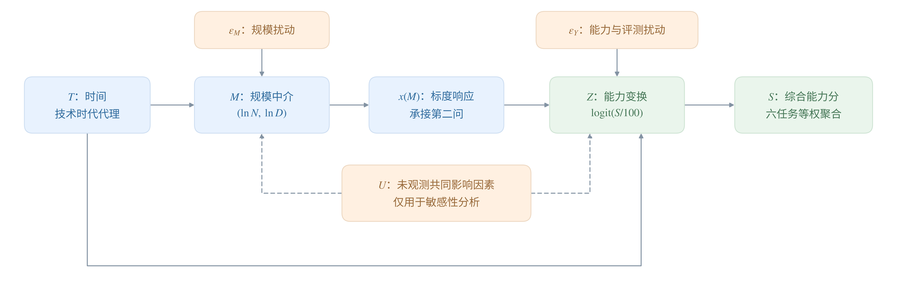
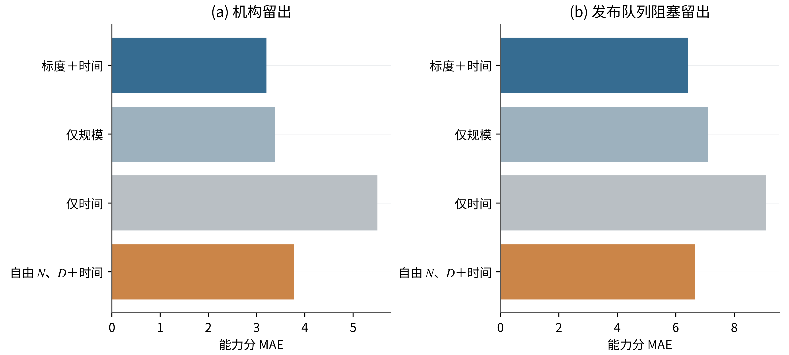
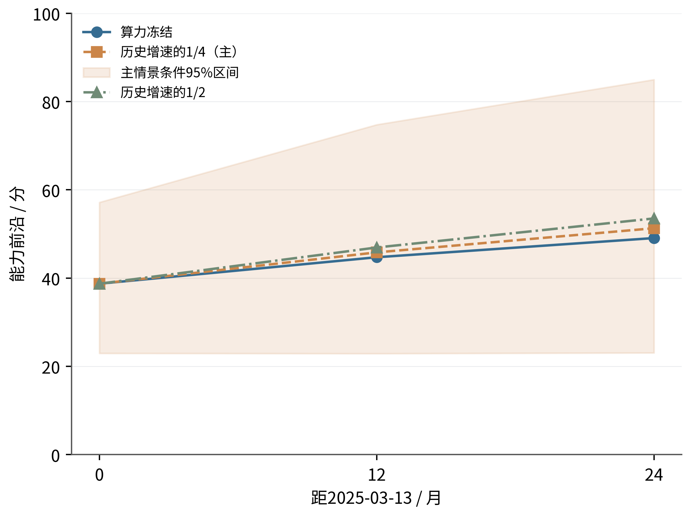
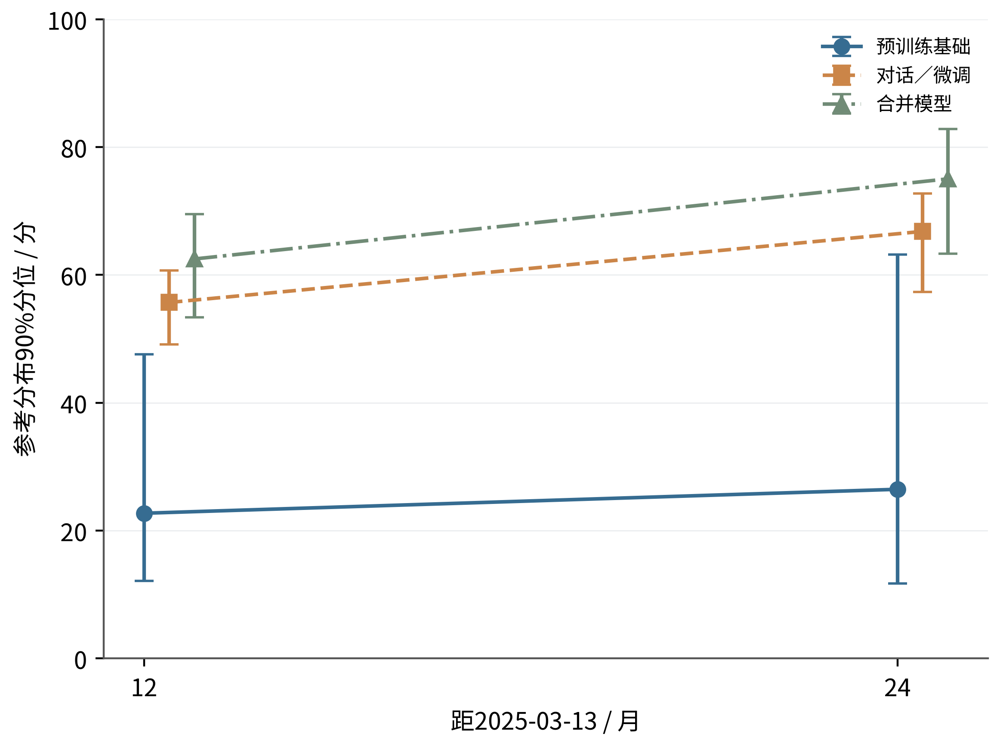
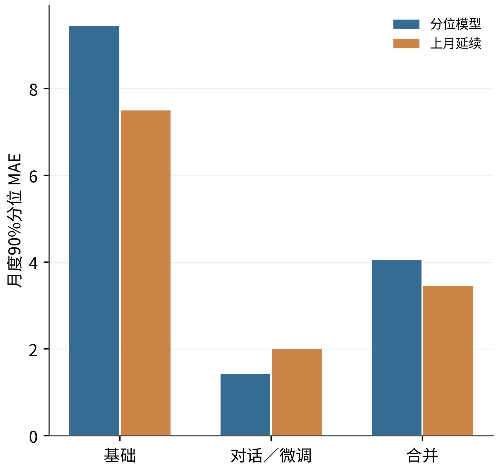

## 8  技术演进的历史归因与条件前沿预测

本问围绕“规模扩张和非规模变化怎样共同影响能力，以及算力增速放缓后这种关系如何延伸”展开。历史部分估计时间经参数量与训练量传递的规模路径，以及控制规模后的非规模路径，再用反事实计算分解能力增量；预测部分将算力情景接入问题三的最优资源配置，计算规模收益并叠加非规模时间收益，得到条件能力前沿。两部分共享问题二的规模指数x(N,D)，历史均值响应与前沿分位响应的系数分别估计，历史贡献比例仅用于解释历史。

## 8.1  研究目标、样本与能力指标

历史归因和结构前沿使用参数量、训练Token数及发布日期齐全的35个基础模型，覆盖10家机构；2449条经筛选、去重的榜单记录用于分类型趋势对照。前者回答完整规模条件下的历史变化与资源前沿，后者检查更广泛模型类型的描述性趋势。“开源”按附件声明权重开放且许可证明确允许至少研究使用的口径筛选，主样本排除已标注底模的衍生模型及明显混合专家模型，不填补缺失训练量。

综合能力S为IFEval、BBH、MATH Lvl 5、GPQA、MuSR和MMLU-PRO六项归一化得分的等权均值，单位为分：

公式 8-1

$$
S_i=\frac{1}{6}\sum_{k=1}^{6}s_{ik},\qquad 0\leq S_i\leq100.
$$

将能力分转换为Z=logit(S/100)，其中logit为比例p的对数优势ln[p/(1−p)]；计算变换时将比例截断至[0.001,0.999]，逆变换为S=100/(1+e⁻ᶻ)。N、D分别表示以十亿计的参数量与训练Token数，公式下标B表示该单位。历史时间T为发布日期距2023年1月1日的年数，每年按365.25天计算；榜单对照采用提交时间。数据匹配、来源分层与逐任务得分已作核查，相关规则、异常文件及其他时间原点集中列于附录四A。

## 8.2  历史能力变化的结构模型

结构中介模型＝用中间规模变量刻画时间影响能力的传递路径。如图8-1，时间通过参数量与训练量变化影响能力，同时保留直接进入能力响应的时间路径。控制规模后的剩余时间变化，在评测口径可比、未处理混杂与选择偏差足够小且比较时期规模充分重叠的假设下，解释为非规模进步；架构、优化与数据工程等因素合并体现，现有数据不再分别识别历史质量和配比贡献。

图8-1  历史能力变化的规模路径与非规模路径

先用两维对数规模向量M描述时间对资源投入的影响：

公式 8-2

$$
M_i=\begin{pmatrix}\ln N_{B,i}\\\ln D_{B,i}\end{pmatrix}=a_0+a_TT_i+\varepsilon_{M,i}.
$$

a₀与a_T为待估计的二维系数，ε_M为规模扰动；允许同一模型的参数量与训练量扰动相关。随后承接问题二已估计的A、B、α、ν，构造可约损失r及规模指数x：

公式 8-3

$$
r(N_B,D_B)=AN_B^{-\alpha}+BD_B^{-\nu},\qquad x(N_B,D_B)=-\ln r(N_B,D_B).
$$

x越大，表示该规模对应的可约损失越低。固定标度形状可以减少小样本的待估参数，同时要求接受这一形状跨模型族迁移的假设。能力响应为

公式 8-4

$$
Z_i=\beta_0+\kappa x(N_{B,i},D_{B,i})+\gamma_TT_i+\varepsilon_{Y,i}.
$$

β₀、κ、γ_T均在本问的35个基础模型上重新估计，历史模型不限制κ与γ_T的符号。主模型假定两维规模扰动与能力扰动ε_Y相互独立，且扰动分布跨期稳定。规模响应和能力逆变换均具有非线性，有限时期的贡献须在能力分尺度计算，不能由两项回归系数的比例直接得到。

## 8.3  历史贡献的求解、结果与验证

## 8.3.1  参数估计与四种反事实情境

求解依次为：最小二乘估计方程 → 保留成对规模残差与能力残差 → 计算四种情境的平均能力 → 求两类贡献 → 按机构重抽样计算区间。两组方程均采用无权最小二乘，能力响应的截距、规模系数和时间系数分别为−3.541544、1.217559和0.191554；中介系数见附录四A。

反事实计算＝在模型中固定一条路径的状态，只切换另一条路径，比较平均能力。令G(t,t′)表示非规模条件取t、规模条件取t′时的平均能力：在t′下生成参数量与训练量，在t下计算能力，再对经验扰动平均。N与D的残差按原模型成对保留，并与能力残差交叉平均，以实现跨方程独立的假设；完整双重求和见附录四A。

四种反事实情境及其含义

| 非规模状态／规模状态 | 初期规模 t₀ | 后期规模 t₁ |
| --- | --- | --- |
| 初期非规模状态 t₀ | G(t₀,t₀) 初期基准 | G(t₀,t₁) 只改变规模 |
| 后期非规模状态 t₁ | G(t₁,t₀) 只改变非规模条件 | G(t₁,t₁) 两条路径均改变 |

分别按“先改变规模”和“先改变非规模条件”计算增量，再对两种顺序取平均。由此定义规模贡献Δ_S和非规模贡献Δ_T：

公式 8-5,8-6

$$
\begin{aligned}\Delta_S&=\tfrac12[G(t_0,t_1)-G(t_0,t_0)+G(t_1,t_1)-G(t_1,t_0)],\\\Delta_T&=\tfrac12[G(t_1,t_0)-G(t_0,t_0)+G(t_1,t_1)-G(t_0,t_1)].\end{aligned}
$$

两类贡献之和恰为G(t₁,t₁)−G(t₀,t₀)，使总能力变化完整分配而不重复计算。比较日期固定为主样本发布日期的上下四分位，即2023年4月3日与2024年6月7日；按机构整组有放回重抽样400次，每次重估两组方程及经验残差，使用2.5%和97.5%分位构造95%区间。

## 8.3.2  贡献结果与稳健性

表8-1  2023年4月3日至2024年6月7日的历史能力变化分解

| 路径 | 贡献／分 | 95%重抽样区间／分 | 占比 |
| --- | --- | --- | --- |
| 规模扩张 | 2.939 | [0.359, 7.412] | 56.98% |
| 非规模进步 | 2.219 | [−1.754, 5.887] | 43.02% |
| 总变化 | 5.159 | [1.905, 10.340] | 100% |

反事实平均能力由9.115分升至14.273分。表8-1的非规模贡献区间包含零，43.02%是有较大不确定性的点估计，其份额95%区间为[−23.91%,89.50%]；机构重抽样反映机构内相关引起的估计波动，不能消除资源与能力之间的混杂。表内由未舍入值计算，显示值相加可能存在末位差异。

图8-2  历史贡献区间与假定混杂强度下的份额变化

自由规模响应下的规模份额为44.44%；当假定混杂相关系数ρ在[−0.6,0.6]内变化时，规模份额为20.12%—93.09%（图8-2）。后者是压力测试范围，不是置信区间，说明“规模是否占多数”依赖响应结构与混杂假设。训练量测量误差的敏感性设置见附录四B。

表8-2  历史能力模型在相同划分下的样本外误差

| 模型 | 机构留出 MAE／RMSE | 日期留出 MAE／RMSE |
| --- | --- | --- |
| 标度响应＋时间 | 3.205／4.646 | 6.426／8.810 |
| 自由lnN、lnD＋时间 | 3.776／5.139 | 6.657／9.136 |
| 仅规模 | 3.375／4.817 | 7.114／9.845 |
| 仅时间 | 5.506／7.158 | 9.088／12.075 |

MAE＝平均绝对误差，RMSE＝均方根误差，均以能力分计。表8-2与图8-3显示主模型在两种留出方式下均优于三个对照，支持同时保留规模与时间项；但机构留出MAE相对仅规模只降低0.170分，日期留出平均偏差为−4.387分，向较晚模型迁移时仍明显低估。这些预测检验不直接证明贡献比例的因果确定性。

图8-3  历史能力模型的机构留出与发布日期阻塞留出误差

## 8.4  算力放缓下的前沿模型与求解

## 8.4.1  预算情景与最优资源配置

历史模型解释平均能力变化；本节另行估计前沿分位响应，共享规模指数x的定义与问题二参数，系数分别拟合。条件第90百分位＝给定规模与时间时能力分布的第90百分位，用于表示领先水平。计算链为：算力增长情景 → 问题三最优资源配置 → 规模收益变化 → 加入非规模时间收益 → 条件能力前沿。

预测以附件最后有效提交日2025年3月13日为基点，12个月和24个月分别对应2026年3月13日、2027年3月13日。215条开放权重算力记录的季度90%分位用于拟合对数趋势，最近一年算力90%分位给出C⋆=3.303422×10²⁴ FLOPs，历史年对数增速g_C=1.033713。令h为预测月数，预算情景为

公式 8-7

$$
C_h=C_\star\exp\!\left[r_C\max(g_C,0)\frac{h}{12}\right],\quad r_C\in\{0,\tfrac14,\tfrac12\}.
$$

r_C=0、1/4、1/2分别对应算力冻结、历史对数增速保留四分之一及二分之一，主情景取1/4。每个预算沿用问题三的损失函数和训练、注意力、提质成本，固定参考配比p₀、域内最高50%文档质量参照、s_Q=1、4096上下文及指数质量成本，求得最优参数量、训练量、质量增量和损失。上述资源情景沿用同一D成本代理，实际Token供给仍属于外推假设。

## 8.4.2  从最优损失到规模收益

在35个完整N、D样本上建立条件分位响应：

公式 8-8

$$
q_\tau(Z\mid x,T)=b_{0,\tau}+\kappa_\tau x+\gamma_{T,\tau}T,\quad\tau=0.9,\quad\kappa_\tau\geq0.
$$

分位回归＝通过非对称绝对残差损失估计指定分位水平。采用线性规划求解，κ_τ≥0保证固定时间下前沿随规模指数单调不减；估计的截距、规模系数与时间系数分别为−2.978248、1.123154和0.292187，线性规划的残差拆分见附录四C。

问题三的最优损失减去不可约损失E后，等于规模项乘以质量和配比的共同修正项：

公式 8-9

$$
L_h^\star-E=\left[A(N_h^\star)^{-\alpha}+B(D_h^\star)^{-\nu}\right]m_h,\qquad m_h=\exp(-\lambda u_h+\eta_p h(p_h)).
$$

式中λ=θ_Q/s_Q，主情景设s_Q=1，η_p承接问题二；λ与质量尺度未由数据分别识别。u_h为质量增量，h(p_h)为沿用问题二的配比响应函数；h(p_h)与表示预测月数的下标h含义不同。主资源路径的配比始终固定，质量持续达到同一参照上限，且E、A、B、α、ν保持不变，因此m_h=m₀。将式（8-9）在未来与起点相除，再代入x=−ln r，得到关键连接：

公式 8-10

$$
x(N_h^\star,D_h^\star)-x(N_0^\star,D_0^\star)=-\ln\frac{L_h^\star-E}{L_0^\star-E}.
$$

式（8-10）把问题三输出的相对可约损失下降转换为问题四的规模指数增益；乘以κ_τ即可进入前沿的logit响应。它要求L_h⋆、L₀⋆均大于E。若质量或配比随时间改变而使共同乘子变化，该损失比还包含相应变化，便不能全部解释为规模收益。

## 8.4.3  非规模时间推进与最终前沿

为限制短期非规模趋势的长期线性延伸，设推进速度按H个月的半衰期衰减。令δ=12ln2/H，h个月的有效推进年数为

公式 8-11

$$
\psi_H(h)=\int_0^{h/12}e^{-\delta t}\,dt=\frac{1-e^{-\delta h/12}}{\delta},\qquad\psi_\infty(h)=h/12.
$$

主情景H=24个月，另考察12个月与不衰减；半衰期是情景设定。记z⋆为起点最优资源对应的分位响应logit，按起点规模与时间代入式（8-8）计算，则未来前沿由“起点能力＋规模收益＋非规模时间收益”组成：

公式 8-12

$$
F_h=100\operatorname{expit}\!\left[z_\star-\kappa_\tau\ln\frac{L_h^\star-E}{L_0^\star-E}+\gamma_{T,\tau}\psi_H(h)\right].
$$

expit(z)=1/(1+e⁻ᶻ)。式（8-12）的中间项由式（8-10）给出，末项加入衰减后的非规模时间收益；历史贡献比例不进入该式。按机构重抽样完整能力样本和算力元数据400次，重估分位系数、预算起点与增长趋势，构造95%重抽样区间，问题二参数固定。快速求解器和预算一致性核验见附录四C。

图8-4  以2025年3月13日为基点的三种算力情景条件前沿

图注：技术半衰期固定为24个月；阴影为主情景95%重抽样区间。条件第90百分位为预测对象，95%为估计区间水平。起点亦为模型估计。

## 8.4.4  前沿结果与覆盖率检验

表8-3  以2025年3月13日为基点的主情景资源配置与条件前沿

| 目标日期 | 预算 10²⁴ FLOPs | N／十亿 | D／十亿 Token | 损失 | 条件第90百分位估计 及95%重抽样区间／分 |
| --- | --- | --- | --- | --- | --- |
| 2025-03-13（起点） | 3.303 | 66.833 | 7245.986 | 1.870 | 38.73 [22.95, 57.16] |
| 2026-03-13 | 4.278 | 75.102 | 8350.038 | 1.863 | 45.83 [22.89, 74.76] |
| 2027-03-13 | 5.539 | 84.394 | 9622.229 | 1.856 | 51.30 [23.05, 84.97] |

表8-3的起点38.73分也是模型估计；主情景在12个月和24个月分别为45.83分、51.30分，相对起点增加7.10分、12.57分。两期参数量均超过主样本最大70B，训练量仍低于样本最大18000B；预测起点已晚于完整样本最新发布日期约0.465年，因此结果同时包含时间与参数规模外推。

表8-4  固定24个月技术半衰期的算力放缓情景比较

| 算力情景 | 12个月估计及95%区间／分 | 24个月估计及95%区间／分 |
| --- | --- | --- |
| 算力冻结 | 44.72 [22.13, 73.80] | 49.07 [21.55, 83.40] |
| 历史对数增速保留1/4 | 45.83 [22.89, 74.76] | 51.30 [23.05, 84.97] |
| 历史对数增速保留1/2 | 46.93 [23.82, 76.41] | 53.52 [24.60, 86.21] |

24个月时，冻结、四分之一增速与二分之一增速分别给出49.07、51.30和53.52分。算力冻结时规模收益为零，继续增长来自模型中推进的非规模时间项；恢复部分算力增长后，主情景相对冻结增加2.23分，二分之一增速再比主情景增加2.22分。各情景区间较宽且重叠，点估计差异的确定性有限，不能据此断言实际前沿必然按该顺序分离。

条件第90百分位的机构留出覆盖率为82.86%，发布日期留出为70.37%，均低于名义90%，对应logit分位损失为0.117和0.149，表明样本外标定不足。覆盖率＝实际能力不超过预测条件分位的比例，与表中95%重抽样区间的置信水平不同；该区间也未覆盖标度跨族迁移、上游参数和技术衰减设定的全部误差。

## 8.5  直接桥接与分类型预测对照

## 8.5.1  另一条损失换算路线的支持范围

主前沿通过相对损失变化与结构分位响应完成预测。本节另用C6配对的损失和六任务平均分，检查绝对损失直接换算为能力能支持到何种范围。按损失可比层ℓ分别拟合等渗回归＝在损失增加时能力不增加的约束下，使平方误差最小的单调函数：

公式 8-13

$$
\widehat f_\ell=\underset{f\;\mathrm{nonincreasing}}{\arg\min}\sum_{i\in I_\ell}(S_i-f(L_i))^2.
$$

预测只在各层观测损失的最小值与最大值之间定义。逐条留出时也仅对处于训练范围内的测试点计算误差，故须同时报告有效点数。

表8-5  直接损失桥接的验证误差及未来支持范围

| 可比层 | 总点数／ 有效留出点 | MAE／RMSE 分 | 对主情景未来损失的支持 |
| --- | --- | --- | --- |
| 高可比 | 7／5 | 0.370／0.444 | 1.863、1.856均超出范围 |
| 中可比 | 68／67 | 7.276／9.039 | 可计算，来源与验证集混合 |

高可比层观测范围为[2.0933,2.5978]，不能支持主情景未来损失1.863和1.856；中可比桥接在两期均给出27.51分，95%区间分别为[20.21,34.99]和[20.56,34.35]，相同点估计来自等渗函数的平台段。中可比层按来源字段留出的66条有效预测MAE为7.365分，且来源别名尚未归并。该结果是独立的跨报告换算对照，与结构前沿在响应、评测来源和时间假设上不同，不再叠加时间收益，也不与主前沿求平均。

## 8.5.2  分类型总体前沿与短期回测

在2449条榜单记录中，分别对192个基础、1542个对话／微调及667个合并模型建立仅含参数量与提交时间的90%分位对照；因缺少D，时间项仅表示描述性变化。基于近期参数分布与经验残差分布，按同一算力主情景和24个月技术半衰期，生成类型总体能力分布，再取第90百分位。它描述类型总体的领先水平，与最优资源路径上的条件前沿分别解释；模型和分布构造见附录四C。

图8-5  分类型总体能力第90百分位的长期情景对照

图注：算力保留历史对数增速1/4，技术半衰期24个月；误差线为按机构重抽样能力样本得到的95%区间，算力趋势固定。三类型横坐标略作错开以避免误差线重叠。

图8-5对应的12个月／24个月点估计依次为：基础22.72／26.46分，对话／微调55.69／66.81分，合并62.49／75.02分。为检验短期预测作用，滚动预测未来1—3个月的同类型月度90%分位，目标月至少有5个模型，以沿用上月90%分位作为基线。

表8-6  分类型月度前沿的短期回测

| 模型类型 | 模型MAE／分 | 上月延续MAE／分 | 有效预测记录 |
| --- | --- | --- | --- |
| 基础 | 9.443 | 7.498 | 11 |
| 对话／微调 | 1.419 | 1.990 | 11 |
| 合并 | 4.041 | 3.457 | 11 |

图8-6  分类型短期预测与上月延续基线的误差比较

表8-6与图8-6中，只有对话／微调类型优于上月延续，MAE减少约28.7%；基础与合并类型均未胜出，其长期结果仅作情景对照。该回测检验类型总体前沿，不直接检验问题三资源路径上的条件前沿，1—3个月回测也不能替代12—24个月的长期验证。

## 8.6  主要结论与适用范围

历史主样本的规模与非规模贡献点估计为56.98%和43.02%，非规模贡献区间包含零，比例对响应结构和混杂假设敏感。承接问题三最优资源后，算力保留历史对数增速四分之一的条件前沿为45.83分和51.30分；24个月冻结及二分之一增速对照分别为49.07分和53.52分，冻结条件下的增长来自非规模时间项。两条主分析共同依赖规模响应的迁移假设，历史比例不直接用于未来预测。

结论适用于35个元数据完整的基础模型及设定的资源路径。前沿区间较宽、样本外覆盖不足，高可比直接桥接不支持未来损失，分类型短期回测也只在对话／微调类型胜过基线。因此，本问提供带有明确假设和不确定范围的历史归因与前沿情景；数值一致性检查及数据审计不替代因果识别与未来实测验证，完整核验清单见附录四D。

## 附录四  数据核查与模型补充

## 四 A  数据口径与经验扰动计算

C1经许可证、日期、参数量和六任务完整性筛选，按仓库去重后保留2449个模型。与C4按规范化名称、参数数量级及发布机构确定性匹配；名称保留参数小数点，有歧义或无法核验的重上传退出主样本。完整基础样本35个，发布日期覆盖2021年3月21日至2024年9月24日。C3的4573条榜单来源记录与26条历史文献记录分层核对，不将不可比历史得分拼接进趋势。

C8逐任务核查扫描1958个JSON，4个损坏文件中1个目录有可解析替代，另3个目录退出逐任务分析，原件保留。MuSR三项叶子任务使用随机猜测基线1/2、1/5、1/3，先计算100max{0,(a−b)/(1−b)}，再等权平均；a为选项长度归一化准确率。匹配C1的1012个模型中，967个重建MuSR与榜单差异不超过10⁻⁶分；结果仅用于核查，不覆盖C1。

能力变换的完整定义为：

公式 四-1

$$
\pi_i=\operatorname{clip}(S_i/100,\epsilon_S,1-\epsilon_S),\quad\epsilon_S=0.001,\quad Z_i=\ln\frac{\pi_i}{1-\pi_i},\quad\operatorname{expit}(z)=\frac{1}{1+e^{-z}}.
$$

中介方程与能力方程采用无权最小二乘。lnN的截距、时间系数为1.322799、0.286528；lnD为6.410831、1.239217。能力拟合为：

公式 四-2

$$
\widehat Z=-3.541544+1.217559x(N,D)+0.191554T.
$$

普通能力预测对训练期能力残差分别作expit逆变换再平均。反事实计算首先使用第a组成对规模残差生成t′时刻规模：

公式 四-3

$$
\begin{pmatrix}N_B^{(a)}(t')\\D_B^{(a)}(t')\end{pmatrix}=\exp(\widehat a_0+\widehat a_Tt'+\widehat\varepsilon_{M,a}).
$$

随后将规模残差与能力残差交叉组合：

公式 四-4

$$
\widehat G(t,t')=\frac{100}{n_Mn_Y}\sum_{a=1}^{n_M}\sum_{b=1}^{n_Y}\operatorname{expit}(\widehat V_{ab}(t,t')),\quad\widehat V_{ab}(t,t')=\widehat\beta_0+\widehat\kappa x(N_B^{(a)}(t'),D_B^{(a)}(t'))+\widehat\gamma_Tt+\widehat\varepsilon_{Y,b}.
$$

本次n_M=n_Y=35。交叉平均对应跨方程独立假设，同时保留N与D残差的相关性。四个角点分别为初期基准、仅改变规模、仅改变非规模条件、两条路径同时改变。总变化绝对值不超过10⁻⁶分时不计算份额。机构重抽样固定比较日期，每次重估两组方程和经验残差。

## 四 B  稳健性检验与桥接细节

机构留出形成35条预测；日期阻塞留出形成54条预测记录，涉及21个不同模型，同一模型可出现在多个截点。训练折重新估计能力系数和扰动分布，表8-2各模型使用相同划分。元数据为事后快照，该检验属于回溯发布队列检验。

混杂压力测试先拟合x=a_x+b_x T+v，令ρ表示v与能力扰动的假设相关程度，并使用：

公式 四-5

$$
\kappa(\rho)=\widehat\kappa-\frac{\rho}{\sqrt{1-\rho^2}}\frac{s_Y}{s_x},\qquad\gamma_T(\rho)=\widehat\gamma_T+[\widehat\kappa-\kappa(\rho)]b_x.
$$

s_x、s_Y分别为上述规模残差与能力残差标准差；截距同步增加“原规模系数与调整后规模系数之差乘以a_x”，能力经验残差保持不变。ρ∈[−0.6,0.6]对应的份额范围属于敏感性情景，不是置信区间。对D整体或仅较晚模型乘以0.5、1、2，检验历史贡献对训练量测量误差的敏感性；逐项删除能力任务的实验则用于检查大样本描述性预测对指标选择的敏感性。

桥接采用C6的Val_Loss、LB_Average及Loss_Comparability字段，C5只作重叠记录核查。高可比7点属于Pythia同族局部范围；中可比68点含跨验证集及近似报告损失。来源留出按Loss_Source原字符串分组；同一报告的不同写法尚未归并，因此不能声称已排除同报告信息相关。

## 四 C  前沿求解与独立分类型对照

算力样本限定在2022年1月1日至2025年3月13日之间发布，权重开放、算力为正、未标注底模、非明显混合专家且置信标记非Speculative的语言建模、代码生成或对话模型，共215个。季度算力90%分位采用对数时间最小二乘拟合，时间原点为2022年1月1日。

条件分位响应通过以下线性规划求解，τ=0.9：

公式 四-6

$$
\min\;\tau\sum_i e_i^++(1-\tau)\sum_i e_i^-,\quad\mathrm{s.t.}\;Z_i-b_{0,\tau}-\kappa_\tau x_i-\gamma_{T,\tau}T_i=e_i^+-e_i^-,\quad e_i^+,e_i^-\geq0,\;\kappa_\tau\geq0.
$$

分位残差由非负e⁺、e⁻表示。κ_τ≥0，截距和时间系数不受符号限制。式（8-12）中的起点logit为：

公式 四-7

$$
z_\star=b_{0,\tau}+\kappa_\tau x(N_{B,0}^\star,D_{B,0}^\star)+\gamma_{T,\tau}t_\star.
$$

t⋆按历史响应的2023年1月1日原点计算。机构及算力元数据重抽样400次，重估分位系数、预算起点与增长趋势，问题二参数固定。质量固定在同一上限的快速求解曾在5.88×10²³—6.05×10²⁵ FLOPs的15个预算点与完整求解器核对，均达到上限且损失相对误差为0；主路径预算最大相对残差为1.26×10⁻¹⁶。这些检查验证计算一致性，不能验证真实训练效果。

大样本对照按模型类型g分别估计：

公式 四-8

$$
q_\tau(Z\mid\ln N_B,T,g)=b_{0,g}+b_{N,g}\ln N_B+b_{T,g}T,\qquad\tau=0.9.
$$

其中b_N,g≥0，榜单时间原点为2024年6月1日。最近三个月的对数参数分布为参照，无近期记录则采用全部训练记录；未来平移量为ν/(α+ν)·ln(C_h/C⋆)，这是对照模型的外推规则。分别在参数分布和拟合残差分布取101个中点分位，交叉组合后取预测分布90%分位，技术时间采用24个月半衰期。表四-1的区间仅按发布机构重抽样能力样本，算力趋势固定；与表8-3同时重抽样算力元数据的口径不同。

表四-1  分类型总体前沿的长期情景对照

| 类型 | 12个月前沿及95%区间 / 分 | 24个月前沿及95%区间 / 分 |
| --- | --- | --- |
| 基础 | 22.72 [12.16,47.59] | 26.46 [11.70,63.21] |
| 对话／微调 | 55.69 [49.12,60.67] | 66.81 [57.31,72.75] |
| 合并 | 62.49 [53.34,69.48] | 75.02 [63.32,82.80] |

表四-1表示类型总体分布的90%分位，表8-3表示问题三最优资源路径上的条件90%分位；统计对象不同。仅对话／微调对照在既有短期回测中胜过上月延续，其他类型的长期数值仅保留为情景对照。

## 四 D  数值与数据一致性检查

已有保存核验共24项通过，按下表集中列出。检查对象是代数恒等式、边界处理、来源一致性和数值实现，不表示因果解释或未来预测已经得到实证验证。

表四-2  已保存的24项数值与数据核验

| 序号 | 核验内容 | 保存状态 |
| --- | --- | --- |
| 1 | 参数小数点名称区分 | 通过 |
| 2 | 主样本模型唯一 | 通过 |
| 3 | 主样本均为基础模型 | 通过 |
| 4 | 训练量未填补 | 通过 |
| 5 | 贡献分解可加 | 通过 |
| 6 | 同一时间零效应 | 通过 |
| 7 | 反向时间贡献变号 | 通过 |
| 8 | 规模系数为零时间接贡献为零 | 通过 |
| 9 | 时间系数为零时直接贡献为零 | 通过 |
| 10 | 规模弹性与有限差分一致 | 通过 |
| 11 | 问题三预算可行 | 通过 |
| 12 | 质量上限快速求解一致 | 通过 |
| 13 | 预测分数在定义范围内 | 通过 |
| 14 | 区间上下界有序 | 通过 |
| 15 | 冻结算力规模收益为零 | 通过 |
| 16 | 未来日期从最后有效提交日起算 | 通过 |
| 17 | 算力数据无未来发布日期 | 通过 |
| 18 | 不支持的桥接返回缺失 | 通过 |
| 19 | 桥接函数单调 | 通过 |
| 20 | MuSR三任务等权聚合 | 通过 |
| 21 | MuSR随机基线归一化 | 通过 |
| 22 | 损坏文件完整入账 | 通过 |
| 23 | 输入文件哈希一致 | 通过 |
| 24 | C8原件哈希一致 | 通过 |