# 算力约束下提升大语言模型能力的资源配置建模

## 摘要

针对大语言模型训练中参数规模、训练数据规模、数据质量、领域配比及上下文长度共同受算力约束的问题，本文构建从数据评价到能力前沿预测的四层模型。首先，基于 A1–A3 的 22 项质量信号建立统一方向、长度校正、领域校准与相关性去冗余的样本评分，并以指数凹聚合处理质量短板；基于 A4–A15 比较线性混料、对数线性、样条和梯度提升模型，确定可解释的对数线性配比模型为主方案。其次，将规模项、质量响应和配比响应合并为共同乘性修正标度律，并分离来源基线与共享规模指数。再次，在算力预算、上下文成本及数据提质成本约束下，优化参数量、训练 Token 与质量增量，刻画质量投入从不投入到部分投入、再到达到样本参照上限的条件转移。最后，利用开源模型的历史评测及元数据，构建时间—规模中介模型并预测条件能力前沿。

主要结果显示：质量分数与线性基线的样本排序相关为 0.9894；配比模型的嵌套五折比较中，GBM 预测误差最低，但对数线性模型用于关系解释和受约束配比求解。共同修正标度律在附件 B 的质量情景与配方分组验证中均有改善，但跨尺度迁移仍有明显边界。第三问主情景在预算 $10^{19}$–$10^{24}$ FLOPs、五种上下文窗口和三类提质成本下均达到设定的样本参照质量上限；这表示上限在给定假设下持续活跃，不代表真实训练存在质量饱和。第四问在 35 个完整基础模型样本中估计规模贡献为 56.98%、非规模时间贡献为 43.02%，但后者 95% 区间包含零。2026-03-13 与 2027-03-13 的条件前沿分别为 45.83 分和 51.30 分，均依赖规模增长与技术趋势假设。

**关键词：** 大语言模型；标度律；数据质量；领域配比；算力优化；结构中介；能力前沿

## 1 问题重述与总体建模路线

四问形成递进的建模链：问题一由文本质量信号得到 $Q$，并估计领域配比与交叉熵损失的关系；问题二把规模、质量和配比纳入统一损失方程；问题三在算力约束下求条件最优资源配置；问题四用开源模型历史数据区分规模扩张与非规模时间效应，并预测未来能力前沿。四问接口传递的是模型量与条件预测，不意味着不同附件构成同一个受控实验。

全文中的“观测”指附件中记录的评分、损失或元数据；“条件预测”指在估计模型和外生假设固定后的计算输出。附件 B 的质量数据包含半合成情景，A12–A15 是由较小规模损失曲线外推的结果，第三问质量供给上限来自评分样本筛选参照，第四问的模型规模与训练数据部分来自报告元数据。以上证据类型不等价于独立大规模训练验证。

## 2 符号与数据说明

| 符号 | 含义 |
|---|---|
| $L$ | 验证交叉熵损失；问题四以六项基准等权平均构造能力分数 |
| $N,D$ | 参数量与训练 Token 数，第二、三问按十亿为单位 |
| $Q$ | 问题一的实数质量评分，可为负，不是概率或质量比例 |
| $\mathbf p=(p_1,\ldots,p_{17})$ | 17 个训练领域的份额，满足 $p_i\ge0,\sum_i p_i=1$ |
| $C$ | 训练、提质及注意力代理成本之和，单位 FLOPs |
| $u$ | 固定领域配比下相对基准质量的增量 |
| $T$ | 问题四的中心化年份或按提交日期构造的时间坐标，具体口径见第四问 |

原始数据目录为 `real_attachments/`，编号与文件对应关系及半合成、估算数据说明以 `real_attachments/source_manifest.json` 为准。问题一主要使用 A1–A16；问题二使用问题一导出的接口及 B1–B12；问题三使用前两问接口、C7 上下文范围与附录成本函数；问题四使用 C1、C3–C8。

# 第一部分 问题一 数据质量评价 冲突消解与领域配比

## 3 模型建立

### 3.1 质量指标预处理与统一尺度

记样本为 $i$，指标为 $j\in\{1,\ldots,22\}$，A1参考样本集合为 $\mathcal A$，$n_A=|\mathcal A|$，领域标签为 $d_i$。A2、A3只应用A1已拟合的规则。以下区分原始指标 $x_{ij}$、方向效用 $v_{ij}$、归一化值 $u_{ij}$ 和最终正态分数 $Z_{ij}$。

列表信号按其字段含义压缩。令 $\pi_k(\boldsymbol\ell)=e^{\ell_k-\max_r\ell_r}/\sum_r e^{\ell_r-\max_r\ell_r}$，则二分类取 $\pi_1$，六级序数信号取 $\sum_{k=0}^5k\pi_k$，单元素教育评分取该元素，QuRating取四分量均值。三个DSIR信号均使用 $x_{ij}=\mathrm{DSIR}_{ij}/\max(n_{word,i},1)$。广告类别方向由A1网页域与学术域的均值对照确定，流畅度由arxiv与github对照确定，判定后对扩展集冻结；这属于代理方向判定，不能替代评分器标签说明。非有限指标值以对应A1有效值中位数填补，A1整列缺失则报错。

* **正向型**（越大越好）：教育价值、流畅度、干净度、可读性、推理性、专业性、三个 DSIR 相似度、QuRating、一元词熵、独特词占比、行末标点占比，共 13 个；
* **负向型**（越小越好）：广告概率、非字母词占比、高频 2-gram / 3-gram 字符占比、大写字母占比、数字字符占比，共 6 个；
* **区间型**（落在合理区间最好）：词数、句子数、平均词长，共 3 个。词数与平均词长的合理区间取自 Gopher 规则（Rae et al., 2021：词数 50–100,000、平均词长 3–10 字符），句子数下限取 3、上限取 A1 的 95% 分位数。

正向型取 $v_{ij}=x_{ij}$，负向型取 $v_{ij}=-x_{ij}$。区间型先令 $t=\log_{10}(1+\max(x,0))$（词数、句子数），平均词长则令 $t=x$；把合理区间端点及A1的99.9%分位同步转换为 $t_l,t_h,t_m$，定义

$$
v(t)=\begin{cases}
\operatorname{clip}(t/t_l,0,1),&t<t_l,\\
1,&t_l\le t\le t_h,\\
\operatorname{clip}\left(1-\dfrac{t-t_h}{\max(t_m-t_h,10^{-9})},0,1\right),&t>t_h.
\end{cases}
$$

词数合理区间为 $[50,100000]$，句子数为 $[3,\operatorname{Quantile}_{0.95}^{A1}(n_{sent})]$，平均词长为 $[3,10]$。令 $a_j=\min_{l\in\mathcal A}v_{lj}$、$b_j=\max_{l\in\mathcal A}v_{lj}$，归一化为

$$
u_{ij}=\begin{cases}\operatorname{clip}\left(\dfrac{v_{ij}-a_j}{b_j-a_j},0,1\right),&b_j>a_j,\\0.5,&b_j=a_j.\end{cases}
$$

三类参照分别为全局、长度条件及领域条件。独特词占比记为 $j_U$，格式指标集合为 $\mathcal J_F=\{\text{行末标点占比},\text{非字母词占比}\}$。A1有效词数的 $\ln(1+n_{word})$ 等频分组请求20组，重复分界删除，不拆分相同词数；不足500条的小组与相邻组合并，最终内部边界记为 $b_1^{len}<\cdots<b_{G-1}^{len}$。分组函数为

$$
g(i)=\sum_{r=1}^{G-1}\mathbf1\{\ln(1+n_{word,i})>b_r^{len}\},\qquad
\mathcal A_g=\{l\in\mathcal A:g(l)=g\},\quad
\mathcal A_d=\{l\in\mathcal A:d_l=d\}.
$$

长度无效时用A1正有效词数中位数填补；超出A1长度范围仍落在首/末组并另行标记。样本 $i$、指标 $j$ 的参考集合为

$$
\mathcal R_{ij}=\begin{cases}
\mathcal A_{g(i)},&j=j_U,\\
\mathcal A_{d_i},&j\in\mathcal J_F,\\
\mathcal A,&j\notin\{j_U\}\cup\mathcal J_F.
\end{cases}
$$

最终正态分数统一写为

$$
P_{ij}=\frac1{|\mathcal R_{ij}|}\sum_{l\in\mathcal R_{ij}}
\left[\mathbf1(u_{lj}<u_{ij})+\frac12\mathbf1(u_{lj}=u_{ij})\right],\qquad
Z_{ij}=\Phi^{-1}\!\left(\operatorname{clip}(P_{ij},\epsilon_A,1-\epsilon_A)\right),\quad
\epsilon_A=\frac1{2n_A}.
$$

$\mathbf1$为条件成立取1的指示函数，$\Phi^{-1}$为标准正态分位函数；三类映射的截断量均使用全体A1的 $\epsilon_A$，不改用组样本量。格式指标只按领域分组，独特词只按长度分组，二者不叠加；其余19项含专业性使用全局参照。未知领域报错，不以全局分布偷偷回退。并列值保留中秩，不加噪声；该变换不保证连续或联合正态。图示量 $X_{ij}=(Z_{ij}+B_A)/(2B_A)$、$B_A=\Phi^{-1}(1-\epsilon_A)$ 仅用于展示，不参与质量聚合。

### 3.2 去冗余赋权与综合质量分

记 $\bar Z_j=n_A^{-1}\sum_{i\in\mathcal A}Z_{ij}$，有效指标集合为 $V=\{j:\operatorname{sd}_{A1}(Z_j)>10^{-12}\}$，标准差采用总体分母 $n_A$。在A1上计算

$$
r_{jk}=\frac{\sum_{i\in\mathcal A}(Z_{ij}-\bar Z_j)(Z_{ik}-\bar Z_k)}
{\sqrt{\sum_{i\in\mathcal A}(Z_{ij}-\bar Z_j)^2\sum_{i\in\mathcal A}(Z_{ik}-\bar Z_k)^2}},\qquad j,k\in V.
$$

冗余度及权重定义为

$$
d_j=1+\sum_{k\in V\setminus\{j\}}r_{jk}^2,\qquad
w_j=\begin{cases}\dfrac{d_j^{-\alpha_w}}{\sum_{\ell\in V}d_\ell^{-\alpha_w}},&j\in V,\\0,&j\notin V,\end{cases}\qquad \alpha_w=1.
$$

$\alpha_w$为赋权指数，与第二问规模指数 $\alpha$ 不同；$V$为空时停止计算。常数指标不参与相关性诊断。权重非负且和为1，全部由A1拟合后冻结。线性基线与最终评分为

$$
Q_i^{lin}=\sum_{j\in V}w_jZ_{ij},\qquad
Q_i(\beta)=\begin{cases}-\dfrac1\beta\ln\sum_{j\in V}w_je^{-\beta Z_{ij}},&\beta>0,\\Q_i^{lin},&\beta=0,\end{cases}\quad\beta=0.25.
$$

实现用对数和指数的稳定计算。其边际权重及短板下调量为

$$
\frac{\partial Q_i}{\partial Z_{ij}}=\frac{w_je^{-\beta Z_{ij}}}{\sum_{k\in V}w_ke^{-\beta Z_{ik}}}\ge0,\qquad
\min_{j\in V}Z_{ij}\le Q_i\le Q_i^{lin},\qquad P_i=Q_i^{lin}-Q_i\ge0.
$$

$P_i$与冲突指数 $CI_i$不同，不能解释为按冲突强度直接扣分。令 $\mathcal D_d$ 为领域 $d$ 的文档集合，域级文档均分和按词数加权均分分别为

$$
\mu_d=\frac1{|\mathcal D_d|}\sum_{i\in\mathcal D_d}Q_i,\qquad
\mu_d^{word}=\frac{\sum_{i\in\mathcal D_d}n_{word,i}Q_i}{\sum_{i\in\mathcal D_d}n_{word,i}}.
$$

下游质量映射使用文档均分 $\mu_d$；按词数加权值只是语料质量的辅助近似，不等于真实Token加权。arxiv、github合并A1与扩展集后按领域和文档ID去重，其他域使用A1。

### 3.3 冲突诊断

定义候选指标对、强度及A1高低阈值为

$$
E=\{(j,k):j<k,\ j,k\in V,\ r_{jk}\le-\tau_r\},\quad\tau_r=0.30,\quad
c_{jk}=\max(0,-r_{jk}),
$$
$$
q_j^L=\operatorname{Quantile}_{0.20}\{Z_{lj}:l\in\mathcal A\},\qquad
q_j^H=\operatorname{Quantile}_{0.80}\{Z_{lj}:l\in\mathcal A\},
$$
$$
H_{ij}=\mathbf1(Z_{ij}>q_j^H),\quad L_{ij}=\mathbf1(Z_{ij}<q_j^L),\quad
B_{ijk}=H_{ij}L_{ik}+L_{ij}H_{ik}.
$$

$L_{ij}$在本节是低分指示量，与后文损失 $L$ 不同。分位数沿用程序的线性插值定义；严格不等式避免平台并列被同时计为高、低。候选对权重总和 $W_E=\sum_{(j,k)\in E}c_{jk}$，则

$$
CI_i=\begin{cases}\dfrac{\sum_{(j,k)\in E}c_{jk}B_{ijk}|Z_{ij}-Z_{ik}|}{W_E},&W_E>0,\\0,&W_E=0.\end{cases}
$$

因此 $E=\varnothing$ 时取零；无触发对的样本也取零。冲突标记为 $I_i^{conf}=\mathbf1(CI_i>0)$，集合 $\mathcal D$ 的冲突率为 $|\mathcal D|^{-1}\sum_{i\in\mathcal D}I_i^{conf}$。阈值是诊断口径，不是显著性检验。A2/A3沿用A1的 $E,q^L,q^H$；改变诊断阈值不改变 $Q$，不强制固定比例的样本被判冲突。

### 3.4 配比与损失关系及约束求解

**训练目标与验证范围。** 配方样本为 $r$，训练领域为 $j=1,\ldots,17$，验证领域为 $k=1,\ldots,13$，响应为 $y_r=13^{-1}\sum_kL_{rk}$。配比满足 $p_{rj}\ge0,\sum_jp_{rj}=1$。问题一仅在A4/A5的512组1M训练配方内进行嵌套五折：外层种子0产生折外预测，内层种子1按均方误差选参数；最终再在完整训练集内五折选参并拟合。A6–A11固定作1M、60M、1B检验，不参与问题一选参；A12–A15为外推表，只作外推情景检查。“同配方跨尺度同折”属于问题二的配比迁移诊断，不能用来描述问题一。

四个候选模型使用同一 $y_r$：

$$
f_{lin}(p)=\sum_{j=1}^{17}b_jp_j,\qquad
f_{log}(p)=c+\sum_{j=1}^{17}a_j\ln(p_j+\varepsilon_p),
$$
$$
f_{spl}(p)=c+\sum_{j\ne j_{ref}}\sum_m b_{jm}B_{jm}(p_j),\qquad
f_{GBM}(p)=f_0+\zeta\sum_{m=1}^{M}T_m(p).
$$

线性模型不另设截距，以最小二乘拟合；对数线性同样最小二乘，$\varepsilon_p\in\{10^{-4},10^{-3},10^{-2},0.03\}$由内层验证选择。样条以uspto_backgrounds为参考域，其他16域采用4个均匀节点的二次样条、线性外推，基函数在训练折内标准化后作岭回归，目标为 $\sum_r(y_r-f_{spl}(p_r))^2+\alpha_R\sum_{jm}b_{jm}^2$，截距不惩罚，$\alpha_R\in\{0.001,0.01,0.1,1,10,100,1000\}$。GBM是逐轮拟合残差的回归树加法模型，学习率 $\zeta=0.03$、子采样比例0.8、树数 $M\in\{300,500\}$、深度 $\{2,3\}$。所有训练折变换仅由该折训练数据确定。

主模型采用对数线性，用于解释与约束求解；GBM作预测对照，该用途选择不等于误差排名第一。训练目标为

$$
(\widehat c,\widehat a)=\arg\min_{c,a}\sum_{r\in\mathcal T}\left[y_r-c-\sum_j a_j\ln(p_{rj}+\varepsilon_p)\right]^2.
$$

**KKT求解。** KKT条件＝约束最优点的一阶驻点、原始/对偶可行性及互补条件。当前拟合全部 $a_j<0$ 时，Hessian为正定对角阵 $\operatorname{diag}[-a_j/(p_j+\varepsilon_p)^2]$，目标严格凸。令等式约束乘子为 $\xi$、非负约束乘子为 $\mu_j$，避免与问题二质量系数 $\lambda$混淆：

$$
\mathcal L=f_{log}(p)+\xi(\sum_jp_j-1)-\sum_j\mu_jp_j,
$$
$$
\frac{a_j}{p_j+\varepsilon_p}+\xi-\mu_j=0,\quad
p_j\ge0,\ \mu_j\ge0,\ \mu_jp_j=0,\ \sum_jp_j=1.
$$

因而

$$
p_j^*=\max\left(0,-\frac{a_j}{\xi}-\varepsilon_p\right),\qquad
\sum_j\max\left(0,-\frac{a_j}{\xi}-\varepsilon_p\right)=1,\quad\xi>0.
$$

求解最后的单调标量方程后，以SLSQP数值约束优化核验。若系数条件不成立，程序停止而不继续套用该凸解。候选只对当前拟合曲面最优，不是已实测训练最优。

**领域替代。** 单位向量记为 $e_j$。由领域 $k$ 向 $j$ 转移份额 $\delta$ 时，$p'=p+\delta(e_j-e_k)$，$0\le\delta\le p_k$，有限变化与边际变化分别为

$$
\Delta_{j\leftarrow k}(\delta)=a_j\ln\frac{p_j+\delta+\varepsilon_p}{p_j+\varepsilon_p}+a_k\ln\frac{p_k-\delta+\varepsilon_p}{p_k+\varepsilon_p},\qquad
\left.\frac{d\Delta_{j\leftarrow k}}{d\delta}\right|_0=\frac{a_j}{p_j+\varepsilon_p}-\frac{a_k}{p_k+\varepsilon_p}.
$$

另一个代码使用的方向为 $p(t)=(1-t)p+te_j$，$t\in[0,1]$，其导数

$$
g_j(p)=\left.\frac{df_{log}(p(t))}{dt}\right|_0=\frac{a_j}{p_j+\varepsilon_p}-\sum_k\frac{a_kp_k}{p_k+\varepsilon_p}.
$$

此式按路径参数 $t$ 求导，实际目标域份额增加为 $t(1-p_j)$；若按每单位净份额解释，还须除以 $1-p_j$（$p_j<1$）。不能把裸系数 $a_j$ 当作约束净收益或损失弹性。

**质量映射。** 以七个质量域文档均分的等权均值 $\bar\mu=7^{-1}\sum_d\mu_d$为收缩中心，A16映射 $d(j)$给出配方域的质量代理

$$
Q_j^{mix}=\begin{cases}\kappa_j\mu_{d(j)}+(1-\kappa_j)\bar\mu,&d(j)\text{有质量样本},\\\bar\mu,&d(j)\text{无对应样本},\end{cases}\qquad
\kappa_j=\begin{cases}1,&direct,\\0.8,&near\_direct,\\0.5,&inferred.\end{cases}
$$
$$
Q_0(p)=\sum_{j=1}^{17}p_jQ_j^{mix},\qquad f_{aug}(p)=c+\sum_ja_j\ln(p_j+\varepsilon_p)+b_QQ_0(p).
$$

无对应样本的11域取 $\bar\mu$，不宣称已获得其质量实测。$f_{aug}$是附加特征对照，主配比模型仍为 $f_{log}$；$Q_0$是 $p$的确定函数，预测改善不能单独识别质量因果效应。

## 4 模型求解与结果

平方相关赋权，β=0.25。领域文档均分：arxiv（0.2226）、commoncrawl（0.0728）、c4（-0.0210）、stackexchange（-0.0726）、wikipedia（-0.2058）、github（-0.3445）、book（-0.4208）。arxiv/github采用合并去重全量。

与线性基线的样本排序相关：0.989437；权重范围：0.018288—0.083076。

质量附加特征的检验结果：

|检验集|对数线性(p) Spearman|对数线性(p)+Qbar Spearman|提升|
|---|---|---|---|
|1M 检验集 (A6/A7)|0.9315797379262988|0.9326619363698784|0.0010821984435798|
|60M 检验集 (A8/A9)|0.9116409647516592|0.912723163195239|0.0010821984435799|
|1B 检验集 (A10/A11)|0.7547619047619046|0.7478479853479854|-0.0069139194139192|

领域均分和附加特征检验不证明质量的因果效应；配比主模型仍为对数线性，GBM为对照。

| 数据集 | 全局冲突率 | 两项格式规则局部冲突率 | 信号并集比例 |
|---|---:|---:|---:|
| A1 | 14.36% | 4.64% | 18.37% |
| A2 全量 | 2.31% | 13.79% | 15.60% |
| A3 全量 | 2.49% | 0.00% | 2.49% |

局部冲突只审查两项格式规则与专业性，不等同于对全部 231 对指标做完整域内扫描。独立复算核验了权重、样本 $Q$ 与 $CI$；1971 篇文本的指标恶化检查中，三种情景评分均未上升。这验证了评分方向实现，不能替代独立人工质量标签。book 的 A1 参考样本仅 171 篇，句子数规则和长文本残余关联仍是主要测量限制。

配比模型嵌套五折折外比较中，GBM 的 RMSE、$R^2$、Spearman 分别为 0.0971、0.9105、0.9611；对数线性为 0.1277、0.8450、0.9413；加性样条为 0.1650、0.7414、0.8695；线性模型为 0.2845、0.2311、0.4935。GBM 在该尺度的预测指标整体最佳；对数线性保留为主模型，是因为其关系可解释且可进行受约束配比求解，不能称为单项预测性能第一。

GBM 在 1M、60M、1B 检验集的排序相关为 0.9671、0.9301、0.7211；对数线性分别为 0.9316、0.9116、0.7548。后者在 1B 排序上较高。60M、1B 绝对损失预测的未校准 $R^2$ 为负，说明从 1M 直接迁移不能优于目标尺度均值基线；排序能力不等于绝对损失校准。A12–A15 的外推压缩配比间损失差异，结论仅作为迁移风险提示。质量附加特征的当前检验结果见本节自动生成表；其改善不构成质量因果效应证据。

# 第二部分 问题二 跨来源融合与共同修正标度律

## 5 模型建立

### 5.1 共同修正形式、单位与可识别参数

$N,D$分别以十亿参数和十亿Token计，来源记为 $s$，可约损失项为 $T_N=A_sN^{-\alpha}$、$T_D=B_sD^{-\nu}$、$R_s=T_N+T_D$。用 $\widehat L_s$表示不含观测扰动的预测损失：

$$
L_s^{obs}=\widehat L_s+\epsilon_s,\qquad
\widehat L_s=E_s+R_s\Phi,\qquad
\Phi=\exp[-\lambda u+\eta h(p)],
$$
$$
u=Q-Q_0(p),\qquad Q_0(p)=\sum_jp_jQ_j^{mix},\qquad
h(p)=\frac{f_{log}(p)-f_{log}(p_0)}{s_L}.
$$

$p_0$为问题一512组训练配比的均值，$s_L=\sqrt{n^{-1}\sum_r(y_r-\bar y)^2}$为该训练集13域平均损失的总体标准差。固定这些锚点后 $h(p_0)=0$。$\Phi$共同修正参数项与数据项，$\epsilon_s$表示观测偏差，不与第一问映射截断量混用。

附件B质量刻度记为 $q_B$，采用

$$
u=s_Q(q_B-1),\qquad\theta_Q=\lambda s_Q,\qquad
\widehat L_B=E+(AN^{-\alpha}+BD^{-\nu})e^{\theta_Q(1-q_B)}.
$$

$s_Q>0$是两个质量刻度间的转换斜率。数据只能识别 $\theta_Q$，不能分别识别 $\lambda,s_Q$；情景取 $s_Q\in\{0.5,1,2\}$，再计算 $\lambda=\theta_Q/s_Q$。质量和配比实验分开拟合，组合为 $\Phi$属于联合迁移假设，不构成四因素受控实验。

### 5.2 各阶段估计目标与验证划分

**规模基线。** 在B1上令 $\vartheta=(\ln E,\ln A,\alpha,\ln B,\nu)$，预测 $\ell_i=E+AN_i^{-\alpha}+BD_i^{-\nu}$，最小化

$$
\widehat\vartheta=\arg\min_{\vartheta}\sum_i\rho_{\delta}(\ln\ell_i-\ln L_i^{obs}),\quad\delta=0.01,\qquad
\rho_\delta(r)=\begin{cases}\frac12r^2,&|r|\le\delta,\\\delta|r|-\frac12\delta^2,&|r|>\delta.\end{cases}
$$

$\ln E\in[-12,4]$，$\ln A,\ln B\in[-12,8]$，$\alpha,\nu\in[0.01,1.5]$；多起点取目标最小者，普通对数最小二乘作对照。该Huber目标只用于规模拟合，不用于下面所有阶段。B1按整个模型规模留出，避免同轨迹检查点随机拆行。

B2按参数规模排序，交替规模组成校准/验证集；共享指数时在校准集求非负最小二乘的 $(E_2,A_2,B_2)$，另拟合自由指数作对照。B4/B5按family/source分组，以 $r_i=AN_i^{-\alpha}+BD_i^{-\nu}$为固定基线，来源校准目标为

$$
(\widehat E_s,\widehat c_s)=\arg\min_{E_s,c_s\ge0}\sum_{i\in\mathcal T_s}(L_i^{obs}-E_s-c_sr_i)^2.
$$

其含义是 $A_s=c_sA,B_s=c_sB$的受限校准；仅偏移对照取 $c_s=1,E_s=\max(0,\overline{L-r})$。至少3点的来源实施来源内留一，其余只做直接迁移诊断；这不是整来源留出。B2是半合成，B3插值、B10估算只作一致性诊断，B9是元数据，均不冒充独立真实训练验证。

**质量响应。** 冻结B1的 $E,A,B,\alpha,\nu$，在去除 $(N,D,q_B)$重复键的B7上求

$$
\widehat\theta_Q=\arg\min_{0\le\theta\le8}\sum_{i\in B7}
\left[L_i^{obs}-E-(AN_i^{-\alpha}+BD_i^{-\nu})e^{\theta(1-q_{B,i})}\right]^2.
$$

以 $(N,D)$组合分组五折；另用B6拟合预测B7新增质量水平。B8方向单独审计，纳入敏感性时对照非负范围 $[0,8]$与允许负值范围 $[-8,8]$。80次ND组自助重采样形成条件参数区间；半合成情景内区间不包含真实质量刻度的不确定性。

**配比响应。** 冻结问题一 $f_{log},p_0,s_L$及B1指数，取配方实验 $u=0$，最小化

$$
(\widehat E_A,\widehat A_A,\widehat B_A,\widehat\eta)=\arg\min\sum_i
\left[L_i^{obs}-E_A-(A_AN_i^{-\alpha}+B_AD_i^{-\nu})e^{\eta h(p_i)}\right]^2.
$$

三个正幅度参数的对数均限制于 $[-12,5]$，$\eta\in[0,3]$，多起点求解；无配比项对照固定 $\eta=0$。此阶段使用A6–A11的1M/60M/1B配方实验作事后迁移校准，不再把这些数据称为问题二的全新独立检验集。同一完整配方向量四舍五入到10位后分组，跨尺度同配方放同折，再另做完整尺度留出；问题一仍是1M训练集内嵌套五折。元数据匹配取1M/60M实验 $D=1$、1B实验 $D=25$（十亿Token），这些不是CSV逐运行直接记录的D。50次配方组重采样重估配比阶段参数，不能与质量阶段的抽样行号配对伪造联合后验。

### 5.3 边际效应、弹性与等损失替代

对预测均值求导，固定未求导的变量：

$$
-\partial_N\widehat L=\frac{\alpha T_N\Phi}{N},\quad
-\partial_D\widehat L=\frac{\nu T_D\Phi}{D},\quad
-\partial_u\widehat L=\lambda R_s\Phi,
$$
$$
\varepsilon_N=\partial_{\ln N}\ln\widehat L=-\frac{\alpha T_N\Phi}{\widehat L},\quad
\varepsilon_D=-\frac{\nu T_D\Phi}{\widehat L},\quad
\partial_Q\ln\widehat L=-\frac{\lambda R_s\Phi}{\widehat L}.
$$

最后一式为质量半弹性＝质量增加一个评分单位时损失的局部相对变化，固定配比时 $dQ=du$；$Q$可为负，不能对其普遍取对数。

固定 $D,p$，把质量改善 $\Delta u$与原质量下扩大参数到 $N'$作等损失比较，令 $r=e^{-\lambda\Delta u}$、$z=r+(T_D/T_N)(r-1)$，则

$$
\frac{N'}N=z^{-1/\alpha}\quad(z>0),\qquad
\Delta u_{eq}(k)=\frac1\lambda\ln\frac{T_N+T_D}{k^{-\alpha}T_N+T_D}\quad(\lambda>0).
$$

$z=0$只有 $N'\to\infty$时达到，$z<0$无有限或无限参数扩张能达到；$k$为参数扩张倍数。该比较不固定算力，$\lambda=0$时不使用第二式。

仅计训练成本且固定质量和配比时，$C=6\times10^{18}ND$，共同因子在一阶最优条件中抵消：

$$
\alpha T_N=\nu T_D,\qquad
N^*=\left(\frac{\alpha A_s}{\nu B_s}\right)^{1/(\alpha+\nu)}
\left(\frac C{6\times10^{18}}\right)^{\nu/(\alpha+\nu)},\qquad
D^*=\frac C{6\times10^{18}N^*}.
$$

若另外考虑每原始Token的提质成本 $g(Q)-g(Q_0)$且暂不计注意力，比较单位边际算力的质量收益与参数收益得到

$$
g'(Q)<\frac{6\lambda R_sN_{raw}}{\alpha T_N},\qquad N_{raw}=10^9N.
$$

这里 $g$必须以当前 $Q$刻度定义；第三问采用 $z=T(Q)$时需链式求导，不能直接代入题设参数。本节经典解析分配也不能替代第三问总成本约束优化。

### 5.4 领域替代与组合效应

固定额外质量增量 $u$，由域 $i$向域 $k$转移 $\delta$，$p'=p+\delta(e_k-e_i)$，$0\le\delta\le p_i$，则

$$
\widehat L(p')-\widehat L(p)=(\widehat L(p)-E_s)\left[\exp\left\{\frac\eta{s_L}(f_{log}(p')-f_{log}(p))\right\}-1\right],
$$
$$
\left.\frac{d\widehat L}{d\delta}\right|_0=(\widehat L-E_s)\frac\eta{s_L}\left(\frac{a_k}{p_k+\varepsilon_p}-\frac{a_i}{p_i+\varepsilon_p}\right).
$$

其他域按比例补偿域 $i$的净份额增加时，约束弹性为

$$
\varepsilon_{p_i}^{con}=\frac{p_i(\widehat L-E_s)\eta}{\widehat Ls_L}
\left[\frac{a_i}{p_i+\varepsilon_p}-\sum_{j\ne i}\frac{p_j}{1-p_i}\frac{a_j}{p_j+\varepsilon_p}\right],\qquad p_i<1.
$$

如固定绝对 $Q$而非 $u$，由 $du=-dQ_0$，方向导数还需增加 $(\widehat L-E_s)\lambda\nabla Q_0^Tv$，不能混用两种比较条件。以pile_cc为补偿域 $r$，$v=e_i-e_r,w=e_k-e_r$，在 $2\delta\le p_r$下定义组合差

$$
I_{ik}=\widehat L(p+\delta v+\delta w)-\widehat L(p+\delta v)-\widehat L(p+\delta w)+\widehat L(p).
$$

$I_{ik}<0$表示该基点、补偿规则和步长下联合改善更强；差异可能来自共同补偿域和指数链接曲率，不是因果互补参数。

## 6 模型求解与结果

B1 拟合得到 $E=1.689838$、$A=0.353969$、$\alpha=0.339985$、$B=1.240275$、$\nu=0.279892$；按规模留出的最大 RMSE 为 0.000214。质量参数 $\theta_Q=0.396659$，ND 组合留出 RMSE 从无质量项的 0.207307 降至 0.062225，改善 70.0%。此结论限于附件 B 的质量情景，不能将半合成数据视作真实训练复验；$\lambda$ 和 $s_Q$ 仍不能分别识别。

配比参数 $\eta=0.079567$，配方分组留出 RMSE 从 0.237195 降至 0.094679，改善 60.1%；完全留出尺度的表现明显较差，故模型适合已覆盖范围内的条件分析，不能据此承诺任意尺度外推。规模、质量和配比边际效应及等损失替代式均作了数值核验。$Q$ 是可为负的实数评分，质量效应按半弹性解释，不把 $\ln Q$ 当作通用变换。

模型能说明给定来源校准、质量刻度与配比条件下的相对变化；质量和配比效应来自分开的数据链。跨来源的共同响应结构、质量刻度映射以及质量与配比可分离均保留为工作假设。领域组合差异受补偿域与非线性链接影响，不是因果交互估计。

# 第三部分 问题三 算力约束下的条件资源配置

# 问题三模型建立

## 3.1 输入、质量参照及可行域

参数量 $N$、训练数据量 $D$分别以十亿参数和十亿Token计，$C$以FLOPs计；$p$为固定17域配比，主用 $p_0$，以 $p^*$作对照，不把配比作为本问连续决策变量。问题一提供配方域质量代理 $Q_j^{mix}$，问题二提供 $E,A,B,\alpha,\nu,\theta_Q,\eta_p$及 $h(p)=[f(p)-f(p_0)]/s_L$。定义

$$
Q_0(p)=\sum_jp_jQ_j^{mix},\qquad Q=Q_0(p)+u,\qquad
\lambda=\theta_Q/s_Q,\quad s_Q\in\{0.5,1,2\}.
$$

$u$是同配比下的额外质量增量，$s_Q=1$为主情景。以A1七域等权分布确定成本锚点：每条A1文档权重 $\omega_i=1/(7n_{d_i})$。按 $Q_i$升序排列后累计 $W_m=\sum_{i\le m}\omega_i$，在点 $(W_m,Q_{(m)})$间线性插值，得到 $q_{low}=q_{.01}$、$q_{high}=q_{.99}$；超出累计端点时取端点值。这与程序的加权分位插值一致，不等同于把全部文档直接等权。

$$
z=T(Q)=\frac{Q-q_{low}}{q_{high}-q_{low}},\qquad z_0=T(Q_0),\qquad \Delta q=q_{high}-q_{low}>0.
$$

锚点固定后不逐篇截断质量分数；当前情景检查 $0<z_0\le z\le1$，不把 $z=1$自动解释为实际可获得的最高质量。

令 $\mathcal D_d$为领域合并去重后的样本，按质量降序、ID升序排序，保留前 $m_d(r)=\max(1,\lceil r|\mathcal D_d|\rceil)$篇，集合记为 $\mathcal T_d(r)$。文档参照均值与可允许的质量增量为

$$
\mu_d(r)=\frac1{m_d(r)}\sum_{i\in\mathcal T_d(r)}Q_i,\qquad
U(p;r)=\sum_{j\in\mathcal M}p_j\kappa_j[\mu_{d(j)}(r)-\mu_{d(j)}(1)],
$$
$$
0\le u\le U(p;r),\qquad r\in\{0.8,0.5,0.2,0.1,0.05\}.
$$

$\mathcal M$为A16中有质量样本映射的配方域，$\kappa_j$沿用第一问的1/0.8/0.5；无映射的11域新增收益为零，收缩中心 $\bar\mu$保持不变。$r=0.5$只是展示切片；中间质量水平连续可调属于模型假设。文档保留率不等于Token保留率，样本尾部均值也不能证明可供应足量训练Token。

## 3.2 总成本与优化问题

上下文长度 $\ell$外生取C7的2048、4096、8192、32768、131072。注意力系数记为 $\eta_{att}=2\times10^{-4}$，与配比响应 $\eta_p$不同。三类每Token成本函数并列为

$$
g_{exp}(z)=10^7e^{6z},\qquad g_{pow}(z)=5\times10^9z^4,\qquad
g_{log}(z)=2\times10^9\ln(1+10z).
$$
$$
g'_{exp}(z)=6\times10^7e^{6z},\qquad g'_{pow}(z)=2\times10^{10}z^3,\qquad
g'_{log}(z)=\frac{2\times10^{10}}{1+10z}.
$$

记 $[x]_+=\max(x,0)$，则

$$
C_{train}=6\times10^{18}ND,\quad C_{att}=\eta_{att}\ell\times10^{18}ND,\quad
C_Q=10^9D[g(z)-g(z_0)]_+.
$$

定义 $k=10^{18}(6+\eta_{att}\ell)$、$c(u)=10^9[g(z_0+u/\Delta q)-g(z_0)]_+$，约束写成 $D[kN+c(u)]\le C$。$k$以十亿参数和十亿Token为计算单位，$c$为每十亿训练Token的额外提质FLOPs。三项成本共用同一个 $D$，这是题设成本代理，未增加原料库存或筛选流水线。

$$
\min_{N,D,u}\ L=E+(AN^{-\alpha}+BD^{-\nu})\exp[-\lambda u+\eta_ph(p)],
\qquad N,D>0,\ 0\le u\le U,\ D[kN+c(u)]\le C.
$$

$E,A,B$沿用B1，$A,B,\alpha,\nu>0$；共享质量/配比响应向B1迁移及正向提质外推均保留为假设。训练与注意力成本之比给出

$$
\frac{C_{att}}{C_{train}}=\frac{\eta_{att}\ell}{6},\qquad
\ell^*=\frac6{\eta_{att}}=30000.
$$

此临界长度是两项成本相等的解析值，不是模型能力突然变化的实测阈值。

## 3.3 内层规模分配与外层质量选择

固定 $u$时损失对 $D$严格递减，最优预算取等号，$D=C/(kN+c)$。令 $x=\ln N$，忽略固定正乘子后的内层目标为

$$
F_C(x;u)=Ae^{-\alpha x}+BC^{-\nu}(ke^x+c(u))^\nu.
$$

若 $q(x)=ke^x+c$，其二阶导数为

$$
\partial_{xx}F_C=\alpha^2Ae^{-\alpha x}
+BC^{-\nu}\nu ke^x q(x)^{\nu-2}[c+\nu ke^x]>0.
$$

两端目标趋于无穷，因此存在唯一内层最优；令 $t_N=AN^{-\alpha},t_D=BD^{-\nu}$，驻点条件是

$$
\alpha t_N=\nu t_D\frac{kN}{kN+c(u)}.
$$

程序在对数坐标自适应扩展括区间并用Brent求根，数值括区间不构成物理边界。$u=0,c=0$时恢复

$$
N_0^*=\left(\frac{\alpha A}{\nu B}\right)^{1/(\alpha+\nu)}(C/k)^{\nu/(\alpha+\nu)},\qquad
D_0^*=C/(kN_0^*).
$$

记内层最优为 $N^*(u),D^*(u)$，$J_C(u)=E+F_C(\ln N^*(u);u)e^{-\lambda u+\eta_ph}$。由于 $g$在当前可行区间递增，$u>0$时以及 $u=0$的右导数有

$$
c'(u)=\frac{10^9}{\Delta q}g'(z_0+u/\Delta q),\qquad
J_C'(u)=e^{-\lambda u+\eta_ph}M(u),
$$
$$
M(u)=-\lambda(t_N+t_D)+\frac{\nu t_Dc'(u)}{kN^*(u)+c(u)}.
$$

$t_N,t_D$均在内层最优点计算。端点局部必要条件为 $M(0)\ge0$、$M(U)\le0$，内点必要条件为 $M(u)=0$；外层不保证凸，不能只靠这些局部条件宣布全局最优。代码比较两端点、65点网格检测到的导数变号根和局部极小精化候选，另外作257点复核与独立二维优化；只对检测到的候选作比较，不宣称区间算术意义上的全局证明。

## 3.4 状态、转移和全局收益阈值

理论状态为

$$
R(u^*)=\begin{cases}R0,&u^*=0,\\R1,&0<u^*<U,\\R2,&u^*=U.\end{cases}
$$

当前五档情景 $U>0$。数值实现使用 $t=u/U$，$t\le10^{-7}$判R0，$t\ge1-10^{-7}$判R2，其余判R1；可约损失差不超过 $10^{-9}\max(L^*-E,10^{-12})$的候选并列报告近优状态。若退化为 $U=0$，理论上只有 $u=0$一个配置；当前求解器以 $u/U$参数化，不直接接收该退化情景。

结构转移＝预算连续变化时全局候选比较所得的活跃质量边界发生改变。内点与边界连续衔接时可由 $M(0;C)=0$或 $M(U;C)=0$求候选预算；若候选分支跳变，还须比较 $J_C(u_a)=J_C(u_b)$。局部驻点方程不能替代全局候选比较，主情景是否存在转移由实际求解决定。

为度量提质需要多强的收益，定义

$$
\mathcal F_C(u)=\min_{N>0}\left\{AN^{-\alpha}+B\left[\frac C{kN+c(u)}\right]^{-\nu}\right\},\qquad H_C(u)=\ln\mathcal F_C(u).
$$

由于 $E$和 $e^{\eta_ph}$固定，质量选择等价于 $\min_{0\le u\le U}[H_C(u)-\lambda u]$。全局下界、上界最优条件分别导出

$$
\lambda_{on}=\inf_{0<u\le U}\frac{H_C(u)-H_C(0)}u,\qquad
\lambda_{full}=\sup_{0\le u<U}\frac{H_C(U)-H_C(u)}{U-u}.
$$

$\lambda<\lambda_{on}$时R0唯一最优，$\lambda>\lambda_{full}$时R2唯一最优；严格中间区间最优属于R1，可能有多个内点。等号时相应端点为最优之一，不必有不同配置与之并列。两集合都含连接0与U的割线，故 $\lambda_{on}\le\lambda_{full}$；相等时可以直接从R0转为R2。端点极限为 $H_C'(0),H_C'(U)$，只提供局部导数，不能替代割线的全局极值。实现采用129点定位及极值精化，并以513点复核代表情景。

## 3.5 资源价值与验证边界

可微最优分支的影子价格＝放宽一单位预算所降低的最优损失：

$$
-\frac{dL^*}{dC}=\frac{\nu t_D e^{-\lambda u^*+\eta_ph}}C,\qquad
-\frac{dL^*}{d\ln C}=\nu t_De^{-\lambda u^*+\eta_ph}.
$$

若 $L_0(C)$为同预算、窗口、配比下的无提质最优损失，其可约部分随 $C^{-\epsilon_C}$变化，$\epsilon_C=\alpha\nu/(\alpha+\nu)$，达到有提质损失所需的无提质等效预算倍率为

$$
\frac{C_{eq}}C=\left[\frac{L_0(C)-E}{L^*(C)-E}\right]^{1/\epsilon_C}.
$$

它是同一条件模型内的预算换算，不是实测加速率。验证覆盖预算残差、经典解析解、内层驻点、外层导数有限差分、扩大括区间、网格加密、独立二维优化以及阈值两侧/内部/等号决策。模型内部数值检验不代替真实训练，也不证明样本参照上限具备足量Token供给。

全局割线阈值、状态定义与影子价格的完整公式见本章3.4—3.5节。以下仅说明情景证据及图件用途，计算结果见模型求解章节。

## 上限情景的证据与图件对应

采用Python定量图组，PNG 300dpi与可编辑文字PDF。现有图01—06保留参考切片与既有验证；新增图07—12承担当前主结论。没有新增训练、重复实验、置信区间或显著性检验；所有损失与决策均为确定性条件预测。

|图|唯一解释任务|源表|主要误读风险|
|---|---|---|---|
|07|筛选提高样本评分，同时降低文档/词数保留量；经映射得到上限组|screening_curve、screening_cap_curve|词数不能当Token；尾部小样本；映射缺失域|
|08|给定预算需要多强的质量收益才能进入R1或R2|threshold_budget_curves|色带为决策区而非置信带；50%仅切片|
|09|增大允许质量范围是否改变最优预测收益|cap_scenario_results|嵌套可行集最优损失不升是数学性质，不是额外实证发现|
|10|提质牺牲多少Token/改变多少N，换来多少等效预算收益|resource_value_analysis|等效算力不是实测加速；高预算外推|
|11|不同上下文下三项成本构成如何变化|budget_scan|同窗口注意力/训练比固定，轨迹不提供独立三维证据|
|12|放大临界收益附近的R0/R1/R2变化|critical_benefit_zoom|横轴是条件λ而非训练估计，折线只连接数值点|

第一、二问模型不变；三类g、T锚点、主预算10^19—10^24与五种上下文不变。改进的是证据组织与条件决策，不为画出转折倒推成本或收益。

# 问题三模型求解

主情景：p0，s_Q=1，各域最高50%文档均值增量上限u_max=0.111512。采用B1损失基线及题设三类成本。
三档预算、五个上下文和三类成本共45个配置；主预算扫描为3015个点，状态集合为['R2']。
主情景在研究窗口内未检测到质量状态转移。全程达到样本参照上限，表示上限在这些假设下持续活跃，不是自然质量饱和的实证发现。

2048上下文主结果（N和D均以十亿计）：

|预算|成本|N|D|u|预测Loss|相对无提质Loss下降|
|---|---|---:|---:|---:|---:|---:|
|1e+19|指数成本|0.2458|5.7980|0.111512|2.961071|0.037855|
|1e+19|幂函数成本|0.2661|5.0020|0.111512|2.977164|0.021762|
|1e+19|对数成本|0.2531|5.4900|0.111512|2.966828|0.032098|
|1e+22|指数成本|5.0340|308.4973|0.111512|2.123876|0.019307|
|1e+22|幂函数成本|5.0598|305.5790|0.111512|2.124173|0.019011|
|1e+22|对数成本|5.0430|307.4810|0.111512|2.123979|0.019205|
|1e+24|指数成本|40.0810|3890.2550|0.111512|1.903748|0.009654|
|1e+24|幂函数成本|40.1072|3885.5434|0.111512|1.903767|0.009636|
|1e+24|对数成本|40.0901|3888.6254|0.111512|1.903755|0.009648|

敏感性中检测到的转移：
- sQ_2，幂函数成本，上下文2048：R0→R1，C≈1.486566e+19 FLOPs。
- sQ_2，幂函数成本，上下文2048：R1→R2，C≈2.011623e+19 FLOPs。
- sQ_2，幂函数成本，上下文4096：R0→R1，C≈1.378814e+19 FLOPs。
- sQ_2，幂函数成本，上下文4096：R1→R2，C≈1.865813e+19 FLOPs。
- sQ_2，幂函数成本，上下文8192：R0→R1，C≈1.201320e+19 FLOPs。
- sQ_2，幂函数成本，上下文8192：R1→R2，C≈1.625628e+19 FLOPs。

验证：33组独立二维优化对照，最大可约损失相对差9.159e-16；最大预算相对残差5.206e-16。
局限：质量响应来自半合成实验且u>0向基准以上外推；s_Q未识别；高预算N/D超出观测覆盖；同一D成本代理不保证原料供给；p*对照依赖跨来源配比修正。当前结果是条件最优预测，不是实测训练最优。

## 结果解释与图件

主预算区间质量上限持续活跃，N和D随预算增加而扩张；提质成本占比下降是预算分配变化，并非质量下降。图1展示规模和投入曲线，图2分解成本，图3显示上下文对规模和Loss的影响。

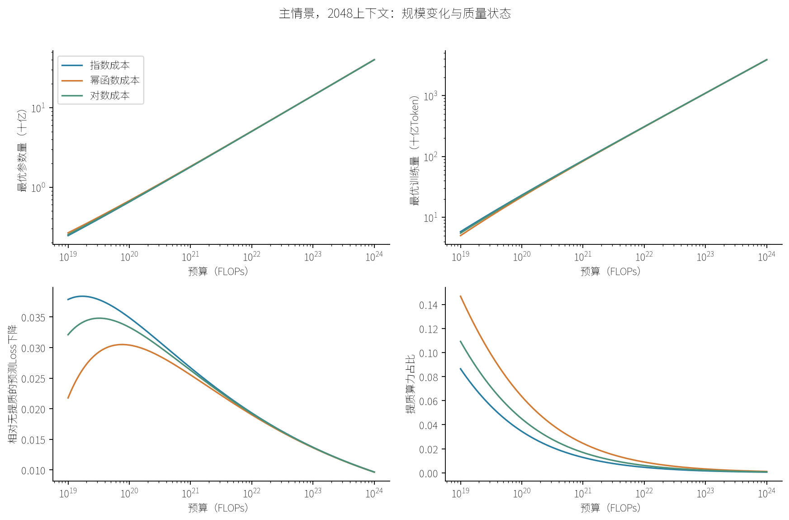

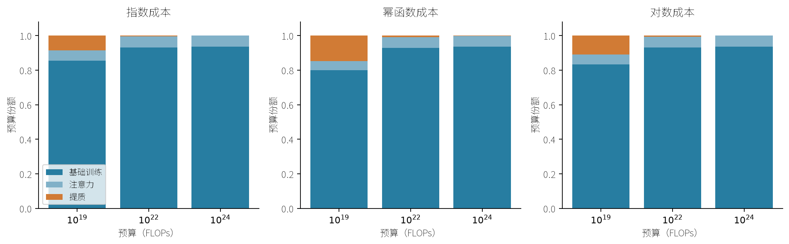

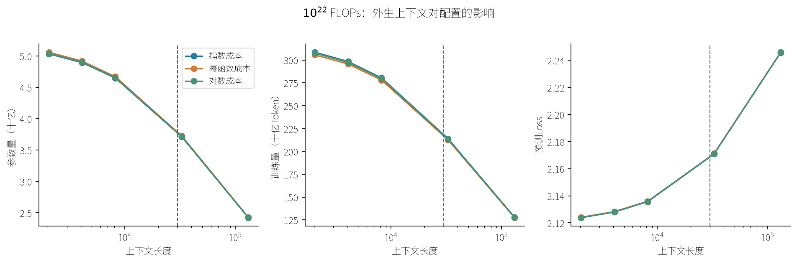

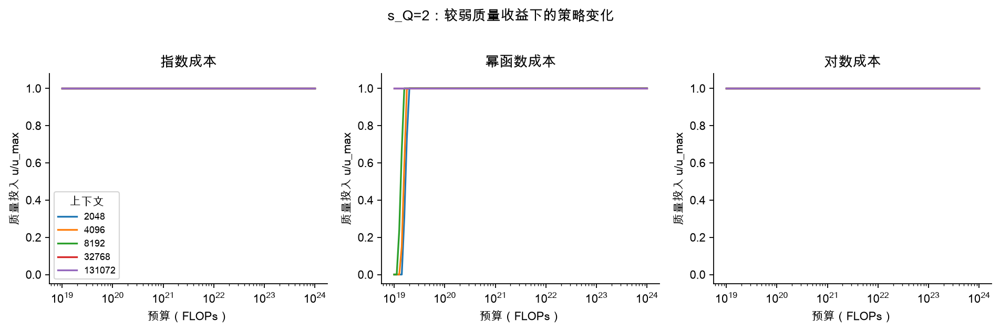

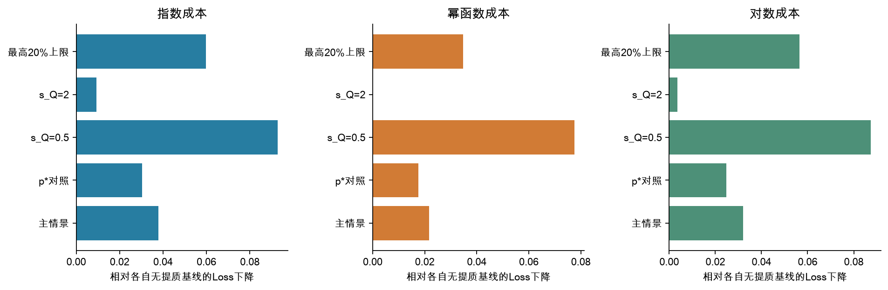

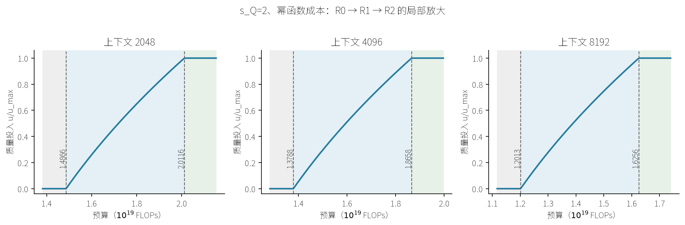

p*对照相对p0的预测Loss改善为0.004912—0.041408，这一比较依赖配比修正迁移假设。质量上限较低并不意味着最终Loss更高。

s_Q=2时，质量响应减弱，幂函数成本出现从不提质到部分提质再到样本参照上限的连续转移。更长上下文减少规模扩张的相对吸引力，转移预算降低；这不能抵消其对绝对Loss的不利影响。转移方程的解析候选与全局数值分支核验相符。

## 上限情景与临界收益决策

质量上限并列采用80%、50%、20%、10%、5%高分文档参照；50%仅为固定展示切片。所有配置为条件预测。
筛选支持是现有样本评分的支持，不等于可供应足量训练Token。book域5%参照仅9篇，尾部情景证据较弱。

|文档参照保留率|p0质量上限U|配置数|状态集合|
|---|---:|---:|---|
|80%|0.052165|45|R2|
|50%|0.111512|45|R2|
|20%|0.186546|45|R2|
|10%|0.230093|45|R2|
|5%|0.268296|45|R2|

在10¹⁹ FLOPs、上下文2048、50%参照下：

|成本|开始提质λ阈值|达到上限λ阈值|开始提质s_Q门槛|达到上限s_Q门槛|
|---|---:|---:|---:|---:|
|指数成本|0.116748|0.151310|3.3976|2.6215|
|幂函数成本|0.237210|0.255454|1.6722|1.5528|
|对数成本|0.174036|0.174036|2.2792|2.2792|

λ越大越有利于提质，s_Q越小越有利于提质。低于λ_on选择R0，高于λ_full选择R2；严格中间区间选择R1；等号处允许并列最优。s_Q=1对应λ=0.396659，只是条件切片。
阈值来自内层重新优化后的全局割线比较；局部端点导数另列，不能替代全局阈值。

完成225个上限情景配置、225组全局阈值、1125个阈值两侧/内部/等号决策核验。
阈值网格129→513最大相对差0.000e+00；影子价值有限差分最大相对差7.835e-11。

三元图说明预算组成；由于注意力/训练比由窗口固定，它不增加独立决策维度。等效算力与影子价值仅适用于同一条件模型；不会据此宣称优于参考版或实测训练。
指数成本、2048窗口、预算1e+19：无提质等效算力倍率1.2106，影子价值−dL*/dlnC=0.203078，提质占比8.644836%，绝对提质成本8.6448e+17 FLOPs。
指数成本、2048窗口、预算1e+24：无提质等效算力倍率1.3332，影子价值−dL*/dlnC=0.032847，提质占比0.058003%，绝对提质成本5.8003e+20 FLOPs。

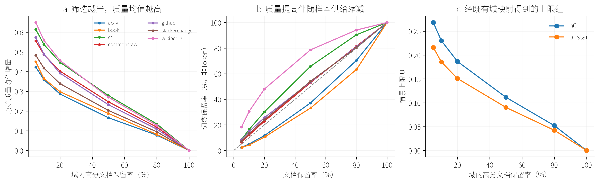

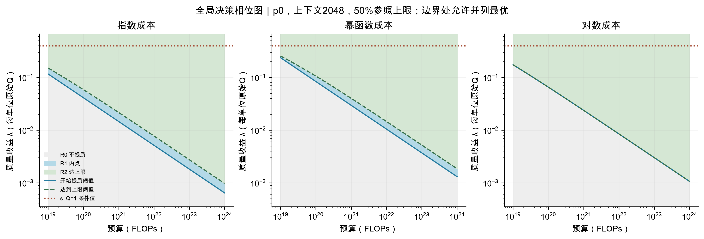

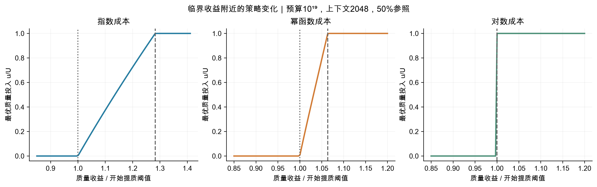

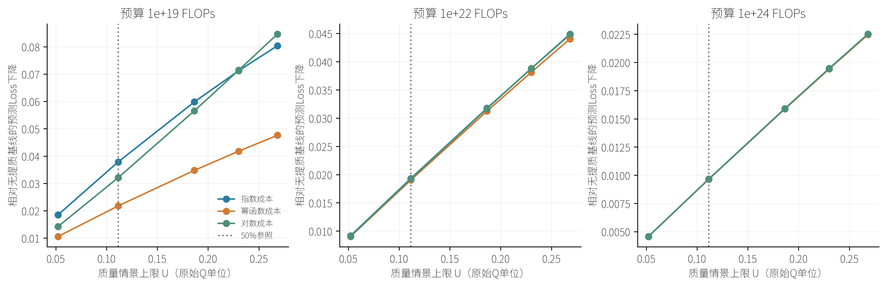

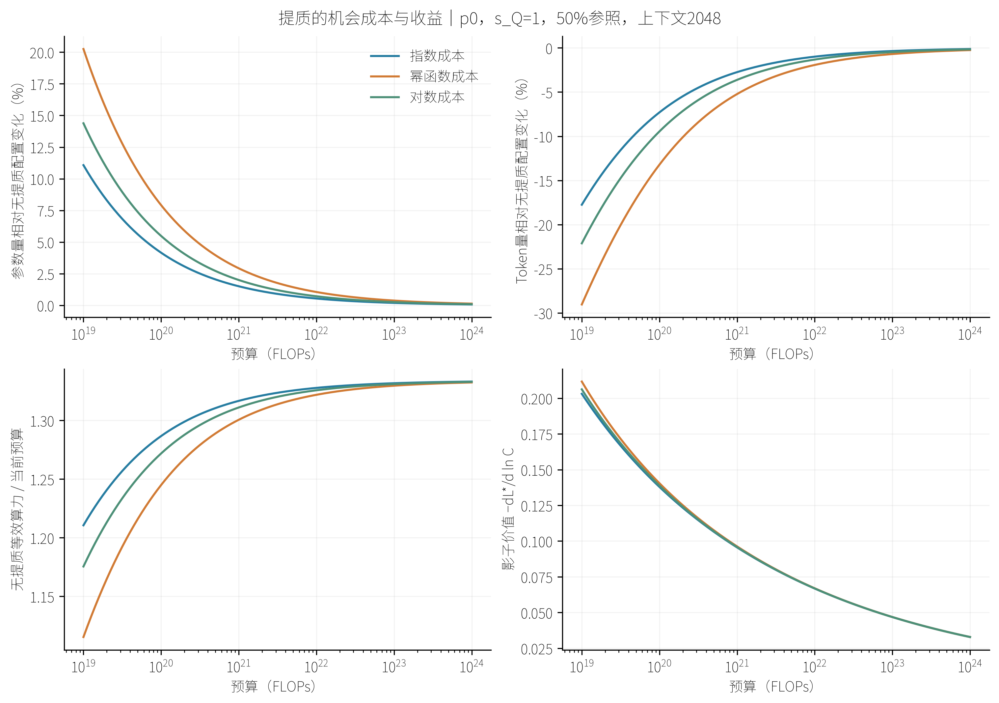

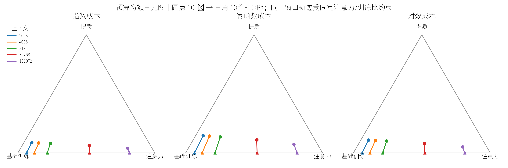

# 第四部分 问题四 技术演进与前沿预测

# 问题四：技术演进的结构中介模型与受算力约束的能力前沿

## 4.1 研究对象与证据结构

本问区分两个统计目标。历史归因回答：在可比较的基础模型中，能力变化有多少经参数量和训练数据量传递，有多少由规模之外的时间路径解释。前沿预测回答：以最后可比评测日期为起点，算力增速放缓时，未来12个月和24个月的领先能力处于何种条件范围。两者不共用一个未经筛选的混合总体。

全部计算数据来自本地附件。C1为模型级能力与类型的来源，C3用于来源分层、年份覆盖和同源分数核对，C4提供发布日期、参数、训练数据量、算力及权重开放信息，C5/C6承担Loss—Benchmark桥接，C8用于逐任务重建。前面三问通过已保存接口和问题三求解器进入第四问，不重新拟合或改变其结果。外部文献仅解释方法，不提供新增观测。

### 4.1.1 能力指标与开源口径

令模型$i$的六个归一化任务得分为$s_{ik}$，以固定等权定义综合能力
$$
S_i=\frac16\sum_{k=1}^{6}s_{ik},\qquad
Z_i=\operatorname{logit}(S_i/100).
$$
六任务依次为IFEval、BBH、MATH Lvl 5、GPQA、MuSR和MMLU-PRO。计算logit时仅将比例裁到$[0.001,0.999]$，防止无穷大；不改变原始分数。等权保持排行榜定义，删除单项任务后的重估检验指标选择的影响。分数是六任务代理能力，不能解释为所有任务的通用智能水平。

“开源”在本问操作化为开放权重、许可证明确允许至少研究使用的模型集合，不声称所有入选许可证都满足OSI开源定义。C1采用代码中显式的许可证允许列表，缺失、unknown和other默认不纳入。完整训练元数据样本还要求C4的`Open model weights?=Yes`。这只是附件声明层面的筛选，不是逐个仓库在线验证。基础模型、对话／微调模型、合并模型、继续预训练模型分别标记；后三者不能因名称相似而被当作独立基础训练实验。

同一仓库模型重复记录取最早有效提交，不把重复评测当作新模型。历史归因只对C1中标为pretrained、C4未标注底模、非明显MoE且$N,D$齐全的模型开展。对话／微调模型常只有后训练数据量，因此不能直接把它填入总预训练$D$。

### 4.1.2 匹配、时间与缺失信息

模型名称匹配采用确定性的规范化键，保留数字间的小数点，防止OPT-1.3B与OPT-13B碰撞。候选必须唯一、参数数量级一致、发布命名空间与元数据组织能够核对；歧义、无法确认的重上传均保留在匹配台账，不能以得分相近为匹配依据。完整样本的$N$采用与$D$配套的C4训练元数据定义，同时保留排行榜参数量用于审计。不补造缺失的训练Token数。

完整$N,D$历史模型使用发布日期，以年为单位并相对固定参考日期中心化。大样本榜单分析使用提交日期。两条时间轴分别建表、估计、解释，不用发布日期补全一部分提交日期后拼成单轴。C3中的历史文献来源与排行榜来源分别汇总；无法确认相同评测标准的早期历史分数不进入能力趋势回归。

元数据为事后收集的快照。按发布日期划分的验证是回溯性发布队列检验，不是复原每个历史时点实际已知的信息集；大样本提交日期回测也不能证明元数据具有完全一致的历史版本。

### 4.1.3 截断JSON与逐任务聚合

C8的每个JSON先做完整解析检查，记录文件哈希、错误和目录。原始文件不修改、不补括号。每个目录选择文件名时间戳最新且可解析的评测；若不存在，目录仅退出逐任务分析，其C1有效记录不因此自动删除。能解析但缺失所需任务的记录也不能补零。

选择MuSR的谋杀推理、物体放置和团队分配三个叶子任务，读取`acc_norm,none`，分别使用随机猜测基线$1/2,1/5,1/3$。单项重建为
$$
\widetilde s_{ij}=100\max\left(0,\frac{a_{ij}-b_j}{1-b_j}\right),
\qquad S_i^{\mathrm{MuSR}}=\frac13\sum_{j=1}^{3}\widetilde s_{ij}.
$$
只有三项齐全才产生聚合值；同时按模型类型汇总各叶子任务。重建值与C1快照对照，但不直接覆盖C1，因为最新评测记录可能采用不同版本。`acc_norm`是评测器的选项长度归一化准确率，不等于已经扣除了随机猜测基线。

## 4.2 因果结构与随机扰动

本研究采用用户确认的关键假设：在模型规模和评测口径可比的条件下，剩余时间路径代表架构、优化、数据工程等非规模技术进步。时间本身不是可操作的技术干预，故这是一个时代变化的结构解释，不是随机试验证实的机制。

因果图的主干为$T\rightarrow(\ln N,\ln D)\rightarrow Z\rightarrow S$，另有$T\rightarrow Z$。前者为规模中介路径，后者为非规模路径。发布机构资源等未观测变量可能同时影响规模与能力，作为偏离主假设的敏感性情形处理。噪声分别进入规模和能力方程，不向观测表随机加数。

令$M_i=(\ln N_i,\ln D_i)^\top$，中介方程为
$$
M_i=a_0+a_TT_i+\varepsilon_{Mi},\qquad
\mathbb E(\varepsilon_{Mi}\mid T_i)=0,
\quad\operatorname{Cov}(\varepsilon_{Mi})=\Sigma_M.
$$
两个规模扰动可以相关：同一模型的参数和数据投资具有共同来源。主模型假定规模扰动与能力扰动独立，并保持跨时期残差分布稳定。潜在结果解释还要求不存在未处理的时间—规模—能力混杂、干扰和严重选择偏差，且相关规模范围有足够重叠。机构重抽样能反映组内相关导致的估计不确定性，不能自动消除机构混杂。

## 4.3 承接标度律的能力响应

### 4.3.1 结构约束与可解释性

沿用问题二接口中的$A,B,\alpha,\nu$和十亿单位，构造可约损失及规模指数
$$
r(N,D)=AN^{-\alpha}+BD^{-\nu},\qquad
x(N,D)=-\ln r(N,D).
$$
能力方程为
$$
Z_i=\beta_0+\kappa x(N_i,D_i)+\gamma T_i+\varepsilon_{Yi}.
$$
该结构把前两问已确定的规模收益形状带入第四问，但$\beta_0,\kappa,\gamma$重新由附件C估计。它避免在小样本中同时重新识别两套幂指数，代价是必须接受标度形状跨模型族迁移的工作假设。主模型不再单独解释$Q$和$p$的历史贡献：它们缺少历史模型级观测，属于非规模时间项所代理的因素。

作为结构敏感性，另拟合
$$
Z_i=\beta_0+\beta_N\ln N_i+\beta_D\ln D_i+\gamma T_i+\varepsilon_{Yi},
$$
同时设置仅规模和仅时间两个简化对照。比较采用同一数据划分和同一能力分误差，不能把不同样本的得分直接排列。

### 4.3.2 局部传导关系

令$w_N=AN^{-\alpha}/r$、$w_D=BD^{-\nu}/r$，则$w_N+w_D=1$，有
$$
\frac{\partial Z}{\partial\ln N}=\kappa\alpha w_N,
\qquad\frac{\partial Z}{\partial\ln D}=\kappa\nu w_D.
$$
由中介方程，局部时间趋势分解为
$$
\frac{\mathrm d Z}{\mathrm dT}
=\underbrace{\kappa(\alpha w_Na_{T,N}+\nu w_Da_{T,D})}_{\text{经规模传递}}
+\underbrace{\gamma}_{\text{非规模路径}}.
$$
能力分尺度上的导数还要乘$S(1-S/100)$。因此不能直接把两个logit回归系数相除解释为能力分贡献；非线性条件下需要反事实计算。

### 4.3.3 参数估计与经验噪声积分

令 $X_M$的第 $i$行为 $(1,T_i)$，$M$的第 $i$行为 $(\ln N_i,\ln D_i)$；$X_Y$的第 $i$行为 $(1,x(N_i,D_i),T_i)$。中介和能力方程分别采用最小二乘：

$$
\widehat A=\arg\min_A\|M-X_MA\|_F^2=X_M^+M,\qquad
\widehat b=\arg\min_b\|Z-X_Yb\|_2^2=X_Y^+Z.
$$

$X^+$为Moore–Penrose广义逆，$\|\cdot\|_F$为所有矩阵元素平方和开根号；代码使用最小二乘分解而非显式求逆，并记录秩及条件数。残差为 $\widehat e_{M,i}=M_i-(1,T_i)\widehat A$、$\widehat e_{Y,i}=Z_i-X_{Y,i}\widehat b$，中介残差的两个分量成对保留。普通能力点预测在分数尺度积分：

$$
\widehat S(x,t)=\frac1n\sum_{b=1}^n100\operatorname{expit}(\widehat\beta_0+\widehat\kappa x+\widehat\gamma t+\widehat e_{Y,b}),\qquad
\operatorname{expit}(z)=\frac1{1+e^{-z}}.
$$

这里 $Z=\ln[p/(1-p)]$、$p=\operatorname{clip}(S/100,0.001,0.999)$是logit变换。第四问的 $Z$为能力变换，不是第一问的指标正态分数矩阵。

## 4.4 有限时期的贡献推导

在完整样本的发布日期四分位区间选定$t_0,t_1$，以减少端点支持不足。令
$$
G(t,t')=\mathbb E_{\varepsilon_M,\varepsilon_Y}
\left[100\operatorname{expit}\left\{\beta_0+
\kappa x\big(\exp(a_0+a_Tt'+\varepsilon_M)\big)+\gamma t+\varepsilon_Y\right\}\right].
$$
外层$t$控制非规模时间路径，内层$t'$控制规模中介的时代状态。中介扰动按模型成对保留，能力扰动按独立残差分布积分。在实际计算中，采用两组经验残差的笛卡尔积平均，保留$N,D$噪声相关性并实现主模型的跨方程独立假设。这同时避免忽略非线性变换的Jensen偏差。

令 $m_a(t')=(1,t')\widehat A+\widehat e_{M,a}$，实际使用的经验积分为
$$
\widehat G(t,t')=\frac1{n^2}\sum_{a=1}^n\sum_{b=1}^n100\operatorname{expit}\{\widehat\beta_0+\widehat\kappa x(e^{m_{a,N}(t')},e^{m_{a,D}(t')})+\widehat\gamma t+\widehat e_{Y,b}\}.
$$
$n$为当前拟合样本数；重采样时使用当次样本的残差和样本数。总变化绝对值不超过 $10^{-6}$分时，代码将贡献占比设为缺失，而非除以近零总量。

规模贡献与非规模贡献定义为两种路径切换顺序的平均：
$$
\Delta_S=\frac12\{G(t_0,t_1)-G(t_0,t_0)+G(t_1,t_1)-G(t_1,t_0)\},
$$
$$
\Delta_T=\frac12\{G(t_1,t_0)-G(t_0,t_0)+G(t_1,t_1)-G(t_0,t_1)\}.
$$
将两式相加，中间两项成对抵消，得到
$$
\Delta_S+\Delta_T=G(t_1,t_1)-G(t_0,t_0)=\Delta_{\mathrm{total}}.
$$
因此该对称分解在能力分尺度严格可加，避免人为指定先扩大规模还是先改进技术。当总变化明显不为零时，贡献占比分别为$\Delta_S/\Delta_{\mathrm{total}}$和$\Delta_T/\Delta_{\mathrm{total}}$。负份额或超过100%的份额表示路径相互抵消，不强制裁剪。

不确定性采用固定种子、按发布机构整组重抽样的400次bootstrap：每次重估中介和能力方程，再在原始固定时间区间重新计算贡献。区间为经验2.5%和97.5%分位，条件于问题二参数及样本选择机制。

## 4.5 验证与未观测混杂敏感性

机构留出验证考察跨机构泛化；发布日期阻塞留出考察从较早发布队列预测较晚发布队列。点预测对能力残差积分后计算MAE、RMSE和偏差。另以90%分位模型检查覆盖率和logit尺度的分位损失，不能把均值预测的误差当作前沿的全部验证。

对未观测混杂，在缩减尺度方程$x=a_x+b_xT+v$中令$v$与能力结构扰动相关系数为$\rho$。在线性残差近似下，对规模系数施加偏差修正
$$
\kappa(\rho)=\widehat\kappa-
\frac{\rho}{\sqrt{1-\rho^2}}\frac{s_Y}{s_x},
\quad
\gamma(\rho)=\widehat\gamma+
\big[\widehat\kappa-\kappa(\rho)\big]b_x,
$$
并相应调整截距。取$\rho\in[-0.6,0.6]$重算贡献。这是保持经验能力噪声分布不变的系数偏差压力测试，不是对真实混杂强度的估计，也不是一般非线性中介模型的精确识别定理。另将$D$统一或仅对较晚模型乘以$0.5,1,2$，检查元数据尺度误差和时变测量偏差的影响。

## 4.6 Loss—Benchmark分层桥接

C6按`Loss_Comparability`划分高可比与中可比层，C5用于检查重叠记录的一致性。每层独立估计非增的等渗函数
$$
\widehat f_\ell=\arg\min_{f\,\mathrm{nonincreasing}}
\sum_{i\in\mathcal I_\ell}(S_i-f(L_i))^2.
$$
等渗回归＝在损失越低、能力不下降的约束下拟合最小二乘分段函数。仅在该层实测损失最小值与最大值之间换算；超出范围返回缺失，不能把输入裁到边界后伪称预测。设层 $\ell$ 的支撑区间为 $[L_{\ell,min},L_{\ell,max}]$，则报告换算值
$$
\widehat S_\ell(L)=\begin{cases}\widehat f_\ell(L),&L_{\ell,min}\le L\le L_{\ell,max},\\\mathrm{NA},&\text{其他}.\end{cases}
$$
留一验证只有训练折支撑区间内的测试点计入误差，并同时报告总点数与可验证点数。中可比层进一步按报告来源整组留出，避免同一报告的近似Loss重复记录被当作独立验证。

高可比层提供同验证集桥接，中可比层只是跨报告情景。二者都不能自动将基础模型的预训练Loss等同于经后训练的聊天能力。问题二到问题四的结构响应是另一个带标度迁移假设的模型，必须与这些直接桥接结果并列比较，不能以结构模型的预测取代桥接证据。

## 4.7 算力放缓下的前沿预测

### 4.7.1 算力路径

预测起点$t_\star$为C1最后有效提交日期。C4仅使用该日及以前发布、权重开放、具有正训练算力、未标注底模、非明显MoE、非Speculative且任务涉及语言建模／代码生成／对话的模型；这仍依赖附件元数据分类。按季度计算训练算力90%分位，拟合其对数时间趋势$g_C$；最近一年算力90%分位作为$C_\star$。
$$
C_h=C_\star\exp\{r_C\max(g_C,0)h/12\},
\quad r_C\in\{0,1/4,1/2\}.
$$
冻结、历史增速四分之一与二分之一分别构成放缓情景，主情景为四分之一。它们是明确假设，不是附件提供的真实未来预算。

### 4.7.2 承接问题三的资源前沿

使用问题三的$p_0$、最高50%文档质量参考切片、$s_Q=1$、4096上下文和指数成本作为展示主情景，求得每个$C_h$下的$(N_h^*,D_h^*,Q_h^*,L_h^*)$。它继承问题一质量评价、问题二共同修正标度律和问题三优化约束，不新建不一致的成本公式。其他质量与三类成本场景单独核对资源和损失敏感性。

在完整$N,D$样本上估计条件90%分位响应
$$
q_{0.9}(Z\mid x,T)=b_{0,0.9}+\kappa_{0.9}x+\gamma_{0.9}T,
\qquad\kappa_{0.9}\ge0.
$$
使用分位损失$\rho_\tau(u)=u(\tau-\mathbf1_{u<0})$构成线性规划求解。规模系数非负是前沿模型的单调约束，不用于强制历史中介贡献为正。

令设计行 $X_i=(1,x_i,T_i)$，分位水平 $\tau=0.9$，残差拆为 $r_i^+-r_i^-$。上述估计实际求解线性规划

$$
\min_{b,r^+,r^-}\ \tau\sum_i r_i^++(1-\tau)\sum_i r_i^-,\qquad
Xb+r^+-r^-=Z,\quad r_i^+,r_i^-\ge0,\quad b_{scale}\ge0.
$$

截距和时间系数不受非负约束。检验集 $\mathcal V$上的前沿覆盖率与分位损失分别为

$$
\widehat{\mathrm{Coverage}}=\frac1{|\mathcal V|}\sum_{i\in\mathcal V}\mathbf1\{Z_i\le X_i\widehat b\},\qquad
\widehat{\mathrm{Pinball}}=\frac1{|\mathcal V|}\sum_{i\in\mathcal V}\rho_{0.9}(Z_i-X_i\widehat b).
$$

名义90%条件分位和预测估计的95%重采样区间不是同一个量。对每个机构与元数据重采样产生的预测 $F_h^{(b)}$，区间端点为 $[\operatorname{Quantile}_{.025}\{F_h^{(b)}\},\operatorname{Quantile}_{.975}\{F_h^{(b)}\}]$；该区间保持问题二参数固定，不含所有结构误差。

为避免短期趋势无限延伸，设技术趋势按半衰期$H$衰减，$\delta=12\ln2/H$，则$h$个月内有效技术推进年数为
$$
\psi_H(h)=\frac{1-\exp(-\delta h/12)}{\delta},
\qquad \psi_\infty(h)=h/12.
$$
主取$H=24$个月，另以12个月和不衰减作敏感性；该半衰期并未由短榜单识别。主资源路径在质量上限保持有效时，$Q,p$固定，因此共同质量乘子在可约损失比值中抵消。预测为
$$
F_h=100\operatorname{expit}\left[
z_\star-\kappa_{0.9}\ln\frac{L_h^*-E}{L_0^*-E}
+\gamma_{0.9}\psi_H(h)\right],
$$
其中$z_\star=b_{0,0.9}+\kappa_{0.9}x(N_0^*,D_0^*)+\gamma_{0.9}t_\star$。这定义了资源最优路径上的基础模型条件90%分位能力，属于可操作的统计前沿，不是绝对最高分保证。$\kappa_{0.9}\ge0$时，固定技术状态与质量乘子，最小化Loss也最大化这一能力响应。

质量改进不在基准截距之外重复加一次：前沿只使用相对Loss变化，时间项代表未单独建模的整体非规模演进。绝对C6桥接另外报告，不再叠加同一时间收益。未来$N,D$超出完整样本范围时逐项标注，不隐藏外推。

预测区间结合完整能力样本的机构bootstrap和C4算力元数据的机构bootstrap，重估能力系数、起点预算与算力趋势；快速资源计算须与完整问题三求解器在预算覆盖范围内比较。该区间不包含未识别的质量尺度、跨验证集系统偏差或所有外推结构误差，成本／质量场景和技术半衰期另行展示，不能揉成没有含义的单个“置信区间”。

### 4.7.3 大样本分类型前沿对照

对基础、对话／微调与合并模型分别拟合$Z=b_0+b_N\ln N+b_TT+e$的分位模型，$D$缺失不补造；故$b_T$仅是描述性时间变化，不能替代完整中介模型的非规模贡献。以最近三个月的参数分布为参考，按$\nu/(\alpha+\nu)$将算力对数增量转换为参数规模增量，再与训练期残差分布组合，取预测能力分布的90%分位。使用固定的101点中点分位网格积分，避免把“条件90%分位在参数90%分位处的值”误认为总体90%分位。

具体地，设 $q_m=(m-1/2)/101$、$m=1,\ldots,101$，令 $n_m$为最近三个月 $\ln N$的 $q_m$分位数，$e_l$为训练期logit残差的 $q_l$分位数。没有最近三个月样本时以全部训练样本作为规模参照。定义

$$
\Delta n_h=\frac{\nu}{\alpha+\nu}r_C\max(g_C,0)\frac h{12},\qquad
S_{ml,h}=100\operatorname{expit}\{b_0+b_N(n_m+\Delta n_h)+b_T[T_\star+\psi_H(h)]+e_l\},
$$
$$
F_h^{broad}=\operatorname{Quantile}_{0.9}\{S_{ml,h}:1\le m,l\le101\}.
$$

$T_\star$在此模型相对2024-06-01，以365.25天为一年；完整训练元数据模型的时间原点为2023-01-01，两者不能互换。残差与规模网格做笛卡尔积，是模型定义的经验分布组合；未宣称由此恢复了未观测训练数据量 $D$。

在逐个历史月截点，仅用此前提交模型和此前发布的算力元数据拟合，预测之后1至3个月的同类型月度90%分位，并与上月90%分位不变的朴素基线比较。样本少于5个的目标月不纳入回测。该验证不能延长为12/24个月的直接实证验证；基础、对话和合并模型分别报告成功与失败。

## 4.8 可复现性与结论边界

全部随机过程固定种子。独立核验包括贡献可加性、同一时间零效应、反向时间符号、关闭路径后的零贡献、规模弹性有限差分、预算守恒、出界桥接缺失、逐任务聚合和原始文件哈希。方法、结果表、图和已运行notebook共享同一入口。数值核验通过说明实现符合公式与输入约定，不说明因果假设已经被证明。

方法参考仅用于定义：[Imai等，因果中介效应的识别与敏感性分析](https://imai.fas.harvard.edu/research/mediation.html)；[Hugging Face，排行榜归一化定义](https://huggingface.co/docs/leaderboards/open_llm_leaderboard/normalization)。本章没有引入这些网站上的额外模型观测。

# 问题四模型求解与结果

## 4.9 数据进入模型后的实际范围

全部观测来自本地附件；未下载外部模型记录。C1原有4576行，经许可证、日期、正参数量、六任务完整性筛选并去除57条重复仓库记录，保留2449个模型。提交时间为2024-06-08至2025-03-13，不足一年。模型类型计数为：{'chat_finetuned': 1542, 'merge': 667, 'pretrained': 192, 'continued': 43, 'other': 5}。合并模型单列，不能当作从头训练的新增资源样本。

C1与C4确定性匹配通过69个模型，其中满足基础模型、非明显MoE、发布日期和训练N/D均可用的主样本为35个、10个发布机构，发布日期覆盖2021-03-21至2024-09-24。历史贡献是这个可比子样本的条件归因，不能直接推成全部开源大模型产业的总体份额。N/D源于报告元数据，部分本身是估计值。

六任务重建均分与C1官方Average的最大绝对差为1.42e-14分，主分析等权口径与原榜单一致。C3共4599行，其中排行榜来源4573行，历史文献来源26行；历史来源只用于来源分层描述，不与同口径排行榜混合回归。图02展示两个时间轴与C3来源差别。

Insert figure here: figures/02_data_and_evolution.png

## 4.10 JSON截断处理与逐任务结果

实际扫描1863个目录、1958个JSON，发现4个解析损坏文件。原件完整保留。1个损坏目录可使用同目录的有效替代评测，3个目录没有可解析评测，仅退出逐任务分析。最终保留1860个可解析模型，其中1856个具有MuSR三个叶子任务完整值；这不表示六大任务全部完整。

选中评测中1012个模型与筛选后C1匹配，其中967个MuSR重建分与C1在1e-6内一致，中位绝对差为0.000000分。差异记录保留在`c8_musr_reconstruction.csv`；最新评测与C1快照可能不同，不通过改写C1消除差异。三个叶子任务的分类型均分见`c8_task_type_summary.csv`与图06。

损坏文件名为：results_2025-02-13T18-27-04.338360.json、results_2025-02-13T18-27-04.338360.json、results_2025-02-13T18-27-04.338360.json、results_2025-02-13T18-27-04.338360.json。完整相对路径、解析错误、替代文件及无有效记录目录分别见`c8_corrupt_files.csv`和`c8_directory_ledger.csv`。处理规则与得分高低无关，未进行截断后拼接或缺项填零。

Insert figure here: figures/06_task_level_audit.png

## 4.11 中介估计与贡献占比

主模型在logit能力尺度的估计为
$$
\widehat Z=-3.541544+1.217559x(N,D)+0.191554T.
$$
完整系数和噪声协方差分别保存于`mediation_coefficients.csv`、`noise_model.json`。时间T的单位为年，零点为2023-01-01；规模项x使用问题二固定参数。能力残差和成对规模残差均来自实际拟合，没有对原始数据额外添加随机噪声。

选取主样本发布日期四分位对比，即2023-04-03至2024-06-07。反事实积分得到起点能力9.115分、终点14.273分，总增量5.159分。这些是同一残差分布下的模型反事实均值，不是两个自然年度榜单的直接观测均分。

| 模型 | 规模贡献/分 | 技术贡献/分 | 总变化/分 | 规模份额 | 技术份额 |
| --- | --- | --- | --- | --- | --- |
| scale_time | 2.939 | 2.219 | 5.159 | 0.570 | 0.430 |
| free_nd | 2.249 | 2.812 | 5.061 | 0.444 | 0.556 |

主模型规模份额为56.98%，非规模份额为43.02%。按发布机构进行400次重抽样，规模贡献95%区间为[0.359, 7.412]分，非规模贡献为[-1.754, 5.887]分。相应份额区间分别为[10.50%, 123.91%]与[-23.91%, 89.50%]，没有裁成0—100%。非规模贡献区间包含零，说明样本不足以精确确定它的符号与比例；用户确认的解释假设并不能消除估计不确定性。

自由N/D系数对照给出的规模份额为44.44%，表明标度响应形状会影响归因。在ρ从−0.6到0.6的偏差压力测试中，规模份额范围为20.12%至93.09%；该范围不是真实混杂强度的置信区间。D测量误差压力测试见`data_volume_sensitivity.csv`。图01明确因果假设，图03展示贡献与敏感性。

Insert figure here: figures/01_causal_structure.png

Insert figure here: figures/03_mediation_and_sensitivity.png

## 4.12 泛化与前沿口径验证

均值能力预测采用相同划分、相同分数尺度评价，结果如下。发布队列留出存在同一模型在不同截点重复出现的情况，表中n是预测记录数，不是独立实验数；机构留出按整组划分。

| design | method | n | MAE | RMSE | bias |
| --- | --- | --- | --- | --- | --- |
| leave_organization | free_nd | 35 | 3.776 | 5.139 | -0.379 |
| leave_organization | scale_only | 35 | 3.375 | 4.817 | -0.228 |
| leave_organization | scale_time | 35 | 3.205 | 4.646 | -0.319 |
| leave_organization | time_only | 35 | 5.506 | 7.158 | -0.617 |
| publication_holdout | free_nd | 54 | 6.657 | 9.136 | -4.779 |
| publication_holdout | scale_only | 54 | 7.114 | 9.845 | -6.300 |
| publication_holdout | scale_time | 54 | 6.426 | 8.810 | -4.387 |
| publication_holdout | time_only | 54 | 9.088 | 12.075 | -7.184 |

条件90%分位的验证另列，不用均值模型RMSE代替：

| design | n | coverage | pinball_logit |
| --- | --- | --- | --- |
| leave_organization | 35 | 0.829 | 0.117 |
| publication_holdout | 54 | 0.704 | 0.149 |

名义90%分位的机构留出覆盖率为82.86%，发布队列留出覆盖率为70.37%，均低于90%。因此该前沿在样本外存在标定不足，不能把拟合分位数当作具有90%实证保障的未来上界。这里保留原始验证结果，不用留出集反向调高截距。

大样本提交日期回测只覆盖未来1—3个月，对照目标是同类型当月能力90%分位。预测时先将条件响应与规模分布、残差分布组合，再取整体90%分位。

| type | method | n | MAE | RMSE |
| --- | --- | --- | --- | --- |
| chat_finetuned | last_month_q90 | 11 | 1.990 | 2.575 |
| chat_finetuned | quantile_N_time | 11 | 1.419 | 1.710 |
| merge | last_month_q90 | 11 | 3.457 | 4.282 |
| merge | quantile_N_time | 11 | 4.041 | 4.532 |
| pretrained | last_month_q90 | 11 | 7.498 | 8.479 |
| pretrained | quantile_N_time | 11 | 9.443 | 12.424 |

按MAE比较，分位模型优于上月延续的类型为：对话／微调；未胜出的类型为：合并、基础。因此对话／微调趋势可以作为有短期比较依据的描述性前沿；基础和合并类型的趋势预测仅作敏感性对照，不声称优于简单延续。短期回测不能为12/24个月外推提供同等强度的验证。主结构模型的长期情景也没有被这些短期榜单结果“证实”。

Insert figure here: figures/07_validation.png

## 4.13 Loss—Benchmark桥接及误差传播

桥接逐层留一结果如下。n为该层总记录，validated_n为测试Loss仍位于训练折支撑区间内的记录；端点出界不参与误差平均，不能只报误差而隐藏覆盖。

| tier | n | validated_n | MAE | RMSE |
| --- | --- | --- | --- | --- |
| high | 7 | 5 | 0.370 | 0.444 |
| medium | 68 | 67 | 7.276 | 9.039 |

中可比层还按报告来源整组留出，共得到68条预测记录，其中66条处于训练支撑范围。可换算记录MAE为7.365分。相同报告的多个模型并不是多次独立标度实验。

Q3未来主配置Loss范围为[1.843212, 1.869591]。高可比层是否支持目标Loss，应逐行看`q3_absolute_bridge_forecast.csv`；当前高可比层支持0个目标配置。中可比桥接仅作为跨报告情景，并传播报告重抽样的不确定性。该桥接输出没有再加一次时间进步项，避免重复计量。高可比的局部小误差不代表其能外推到低Loss、高能力区域。

| horizon_months | tier | loss | prediction | lo | hi | supported | bootstrap_supported |
| --- | --- | --- | --- | --- | --- | --- | --- |
| 12 | high | 1.863 | — | — | — | False | 0 |
| 12 | medium | 1.863 | 27.514 | 20.211 | 34.987 | True | 400 |
| 24 | high | 1.856 | — | — | — | False | 0 |
| 24 | medium | 1.856 | 27.514 | 20.564 | 34.348 | True | 400 |

Insert figure here: figures/05_loss_benchmark_bridge.png

## 4.14 未来12/24个月的条件前沿

预测起点固定为2025-03-13，是附件中最后可比观测日，不是程序运行日。故12个月、24个月的目标分别为2026-03-13和2027-03-13；这些输出不能表述为从2026年9月起的实时预测。C4历史算力样本为215个模型，最近一年预算90%分位为3.303422e+24 FLOPs，季度前沿拟合的年对数增速为1.033713。

主放缓情景取历史对数增速的四分之一，技术趋势半衰期24个月。在问题三p0、50%参考质量切片、s_Q=1、4096上下文、指数成本下得到：

| 目标日 | 预算/FLOPs | N/十亿 | D/十亿Token | Loss | 条件前沿/分 | 区间下限 | 区间上限 |
| --- | --- | --- | --- | --- | --- | --- | --- |
| 2026-03-13 | 4.2776e+24 | 75.102 | 8350.038 | 1.863 | 45.826 | 22.886 | 74.761 |
| 2027-03-13 | 5.5390e+24 | 84.394 | 9622.229 | 1.856 | 51.295 | 23.055 | 84.972 |

这些是基础模型在资源最优路径上的条件90%分位前沿。主样本最新发布日期早于预测起点，模型在起点就已有约0.465年的时间外推；未来参数量超出主样本范围时，`N_extrapolated`逐行标识。质量上限是问题三的文档筛选参照，不能解释为已证实的Token供给保证。

区间包含发布机构层面的能力拟合及算力元数据重抽样不确定性，但条件于问题二参数、非规模解释和结构迁移。不同成本／质量场景共45个资源配置，另有冻结、半增速和技术半衰期敏感性，分别见`q3_cost_quality_sensitivity.csv`及`coupled_frontier_forecast.csv`；它们不是已发生的真实实验。

大样本描述性前沿如下，训练数据量D缺失，时间项不能用于非规模贡献归因。表内参考规模分布固定为最近三个月，并按算力情景平移。

| 类型 | 预测月数 | 描述性前沿/分 | 区间下限 | 区间上限 |
| --- | --- | --- | --- | --- |
| 基础 | 12 | 22.717 | 12.164 | 47.594 |
| 基础 | 24 | 26.463 | 11.696 | 63.205 |
| 对话／微调 | 12 | 55.692 | 49.117 | 60.675 |
| 对话／微调 | 24 | 66.810 | 57.309 | 72.754 |
| 合并 | 12 | 62.493 | 53.337 | 69.484 |
| 合并 | 24 | 75.024 | 63.316 | 82.797 |

当前短期验证支持对话／微调类型优于朴素基线；合并类型虽可能给出更高预测值，但短期预测未胜出，不据其较高数值宣称整体最优前沿。删除单个能力任务的12个月预测范围为：{'chat_finetuned': {'min': 48.33653287539891, 'max': 61.47666751345573}, 'pretrained': {'min': 14.898484387378677, 'max': 30.031651449502505}}。任务权重影响实质性能力定义，不能通过挑选任务得到预期排名。

Insert figure here: figures/04_frontier_forecasts.png

## 4.15 可以成立的结论与尚未识别的部分

本次完整实现了“附件审计→N/D中介分解→Loss桥接→Q3资源耦合→12/24个月前沿与不确定性”的计算链。主样本的点估计支持规模和非规模两条路径均有正贡献，但技术贡献区间包含零，且份额对结构形状和混杂压力测试敏感。扩大模型并非唯一解释，现有数据也不足以确定一个精确、普适的技术贡献百分比。

高可比Loss桥接不能覆盖本次未来资源配置的低Loss区间，中可比映射又存在明显跨报告误差。因此条件结构前沿、描述性聊天前沿及绝对桥接情景并列报告，不合并成一条看似精确的预测线。数据质量刻度、未知训练Token供给、跨族标度迁移、元数据缺失选择与远期技术速率仍是模型边界。

独立数值和证据核验状态：passed，通过24项。验证涵盖公式恒等式、退化情形、有限差分、预算守恒、支撑边界、任务重建及输入哈希；它不构成因果识别证明。结果表是论文数字的唯一来源，原始附件未修改。

# 结论与局限

本文形成了从数据质量、配比、规模响应到资源配置和能力前沿的统一分析链。质量评分适合在给定评分器和 A1 参照下排序；配比模型比较表明预测性能和可解释优化用途并非同一标准；共同修正标度律在已覆盖数据范围内改善拟合，但跨尺度误差与质量刻度仍限制外推；第三问给出明确的条件最优配置和临界质量收益，而主情景始终到达参照上限，不能据此宣称存在已观测到的三阶段转移；第四问的规模与时间贡献分解依赖完整 N/D 样本和中介假设，非规模贡献区间包含零，未来前沿也属于情景预测而非保证值。

主要限制包括：质量标签缺少独立人工校准；A16 只覆盖部分领域的质量映射；附件 B 的质量部分含半合成记录且 $\lambda$ 与评分刻度未拆分识别；高预算情景超出直接训练观测范围，训练 Token 供给成本代理未验证实际可行库存；第四问完整基础模型样本量为 35、发布机构为 10，不能将条件归因推广为全行业因果份额。上述限制需要与数值结果一并解释。

## AI 使用说明

本文写作过程中使用 Codex 对既有 notebook、代码、结果摘要和章节进行结构整理、公式转写与中文文字编辑。核心模型选择、实验代码及输出由参赛队伍既有实验包提供；本文中的数值均据该包现存结果摘要或章节记录。参赛队伍应在提交前逐项复核计算、引用与表述，并按竞赛规定披露 AI 使用范围。

## 参考文献

1. Hoffmann, J., Borgeaud, S., Mensch, A., et al. Training Compute-Optimal Large Language Models. *NeurIPS*, 35, 2022.
2. Biderman, S., et al. Pythia: A Suite for Analyzing Large Language Models Across Training and Scaling. *ICML*, 2023.
3. Xia, M., et al. RegMix: Data Mixture as Regression for Language Model Pre-training. *ICML*, 2024.
4. Bahri, Y., Dyer, E., Kaplan, J., et al. Explaining neural scaling laws. *PNAS*, 121(27), 2024. DOI: 10.1073/pnas.2311878121.
5. Rae, J. W., et al. Scaling Language Models: Methods, Analysis & Insights from Training Gopher. 2021.
6. 2026 年中国研究生数学建模竞赛 F 题题目、数据说明及附件 A–C。
